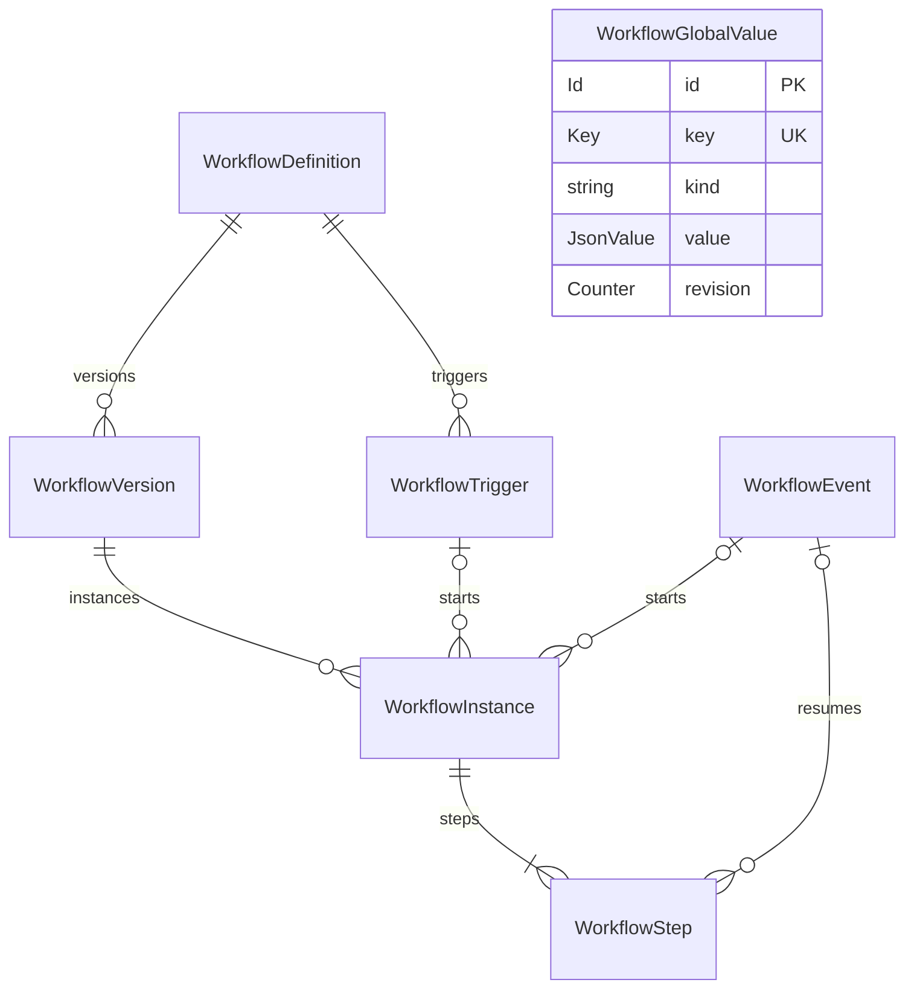

# Модель данных бизнес-процессов

Версия: 0.7. Дата: 2026-09-14.
Статус: **проект для обсуждения; модуль не реализован, схема БД не применена**.

Физические колонки, ORM-отображение и ограничения зафиксированы в
[WORKFLOW_PHYSICAL_MODEL.md](WORKFLOW_PHYSICAL_MODEL.md).
Точное содержимое jsonb задаёт [файл контрактов](workflow_physical_contracts.ts).
Этот документ сохраняет описание назначения данных и правил исполнения;
при реализации источником схемы являются модели существующего ORM Osnova.

Основание: обсуждение дизайнера БП и [архитектура модулей](MODULE_ARCHITECTURE.md).
Владелец всех описанных сущностей — планируемый атомарный `WorkflowModule`.
Доступ к ним — через один `WorkflowDbContext` на общем provider Osnova.
Названия таблиц ниже предлагаются для будущей реализации.

Согласованный объём: зарегистрированные функции существующих сервисов,
условия, циклы, тайм-ауты (отдельные паузы), ожидание изменений, ручной запуск,
события, расписания и сохранение прогресса после перезапуска;
переменные и константы процесса, глобальные переменные и константы.
Все эти определения и значения сохраняются в БД.
Один экземпляр процесса выполняет один текущий шаг.

Этот документ описывает данные. Он не является сгенерированным `MODULE.md`.
При переходе к реализации модуль требуется создать через CLI и заполнить
его паспорт по [шаблону](MODULE_SPEC_TEMPLATE.md).

## 1. Сущности и связи

| Модель | Таблица | Ответственность |
| --- | --- | --- |
| `WorkflowDefinition` | `workflow_definition` | Идентичность, название и активная версия процесса |
| `WorkflowVersion` | `workflow_version` | Неизменяемая сохранённая схема |
| `WorkflowInstance` | `workflow_instance` | Один запуск и его текущее состояние |
| `WorkflowStep` | `workflow_step` | Одно прохождение узла схемы |
| `WorkflowTrigger` | `workflow_trigger` | Запуск процесса по событию или расписанию с выбором его активной версии |
| `WorkflowEvent` | `workflow_event` | Сохранённое событие для запусков и ожиданий |
| `WorkflowGlobalValue` | `workflow_global_value` | Общее для БП типизированное значение: переменная или константа (§9) |



`WorkflowDefinition.activeVersionId` дополнительно указывает на версию этого же
процесса для новых запусков. `WorkflowInstance.currentStepId` указывает на текущий
`WorkflowStep` этого же экземпляра. Версия уже созданного запуска закрепляется в
`WorkflowInstance.versionId`; повторной копии номера версии в запуске нет.
Глобальное значение принадлежит всему приложению и не имеет FK на отдельный
процесс или запуск. Ссылки на его стабильный key задаются в схеме по §9.

## 2. Общие типы и правила

В таблицах `T / null` означает nullable-колонку. Остальные поля обязательны
в сохранённой записи. Поле без default должен заполнить создающий его сервис.

| Тип | Представление и ограничение |
| --- | --- |
| `Id` | UUID в строке приложения, нативный `uuid` в PostgreSQL; генерацией через `@UUID()` и получением ключа управляет ORM |
| `Key` | Непустая строка, до 128 символов; стабильное имя процесса, узла, activity или события |
| `Counter` | Целое число 0…`Number.MAX_SAFE_INTEGER`; для порядкового номера версии/шага минимум 1 |
| `Instant` | `Date` в серверном коде, ORM `datetime`; в JSON — RFC 3339 с часовым поясом, при выдаче UTC |
| `JsonValue` | JSON: null, boolean, конечное number, string, массив или объект из таких значений |
| `JsonObject` | JSON-объект с полями по конкретному контракту; не произвольный `any` |
| `Condition` | Дерево сравнения значений и групп `all` / `any`, описанное в §9 |
| `ValueContract` | Существующий `BoundarySchemaV1`: точное описание типа и проверок для данных процесса и глобальных значений (§9) |

Предложенные пределы идентификаторов — технические ограничения проекта модели.
Строковые статусы сохраняются как `text` с закрытым набором допустимых значений.
Время для сроков, захвата работы и переходов берётся из БД. Длительности
задаются целыми миллисекундами; при входе в ожидание преобразуются в `Instant`.

Текущее отображение типов ORM проверено в
[PostgresDialect](../../src/osnova/library/orm/Providers/PostgresDialect.ts):
`integer` → `bigint`, `datetime` → `timestamptz`, `json` → `jsonb`.
Значения счётчиков ограничиваются безопасным диапазоном JS и на границе, и в БД.

Функции, DI-сервисы, Promise и ORM-сущности в JSON не сохраняются. Даты в данных
activity сериализуются по контракту зарегистрированного метода; типы его аргументов
и результата повторно вручную не описываются. Входы, переменные и результаты
проверяются по схемам. Неизвестные поля закрытых контрактов отклоняются;
открытые словари допускаются только там, где это объявлено явно.

## 3. WorkflowDefinition — какой это процесс

| Поле | Тип / default | Правило |
| --- | --- | --- |
| `id` | `Id`, новый UUID | Первичный ключ |
| `key` | `Key`, нет default | Уникальный стабильный ключ процесса |
| `name` | string, нет default | Отображаемое имя, 1…200 символов |
| `activeVersionId` | `Id / null`, null до первого сохранения схемы | FK → `WorkflowVersion.id` этого же процесса; версия для всех новых запусков |
| `createdAt` | `Instant`, время создания | Не меняется |
| `updatedAt` | `Instant`, время изменения | Обновляется при переименовании и смене активной версии |

Схема и runtime-состояние сюда не помещаются. Ручной запуск принимает `workflowId`,
`requestId` и `input`; автоматический получает `workflowId` из триггера.
При создании нового Instance сервер читает `activeVersionId` и записывает его
в `Instance.versionId`. При null запуск отклоняется: сохранённой схемы ещё нет.
Связь с версией объявляется через `@ForeignKey(() => WorkflowVersion)`.
Принадлежность активной версии этому процессу проверяет сервис внутри
ORM-транзакции сохранения или запуска.

## 4. WorkflowVersion — сохранённая схема

| Поле | Тип / default | Правило |
| --- | --- | --- |
| `id` | `Id`, новый UUID | Первичный ключ |
| `workflowId` | `Id` | FK → `WorkflowDefinition.id` |
| `number` | `Counter`, начиная с 1 | Уникален внутри процесса |
| `document` | `WorkflowDocument`, нет default | Типизированная схема из §9, ORM `json` |
| `createdAt` | `Instant`, время создания | Не меняется |

Ограничение: `UNIQUE(workflowId, number)`. Выделение следующего номера выполняется
под блокировкой строки `WorkflowDefinition`, с проверкой уникальности в БД.

Каждое успешное сохранение проверенной сервером схемы создаёт новую версию
и сразу делает её активной для новых запусков. Вставка Version и смена
`Definition.activeVersionId` выполняются одной транзакцией. Отдельного действия
публикации в этом проекте модели нет. Ошибка проверки или записи отменяет обе
операции; предыдущая активная версия сохраняется.

Сохранённая версия не изменяется. Работающие и ожидающие экземпляры остаются
привязаны к своей версии, в том числе после перезапуска приложения. Например,
после сохранения v2 новые ручные, событийные и плановые запуски получают v2,
а ранее созданные на v1 завершаются по v1.

Доступность всех используемых activity и корректность связей проверяются перед
сохранением и запуском. Перед сохранением также проверяется совместимость
`inputBindings` включённых триггеров с новым контрактом входа. Несовместимость
отклоняет сохранение с конкретной ошибкой; триггер не закрепляется на старой версии.
При включении триггера проверка выполняется относительно текущей активной версии.
Версии, на которые ссылаются запуски или `activeVersionId`, удалять нельзя.

## 5. WorkflowInstance — текущее состояние запуска

| Поле | Тип / default | Правило |
| --- | --- | --- |
| `id` | `Id`, новый UUID | Первичный ключ запуска |
| `workflowId` | `Id` | FK → WorkflowDefinition.id; сервис проверяет владельца versionId |
| `versionId` | `Id` | FK → активная при создании запуска `WorkflowVersion.id`; после создания не меняется |
| `status` | `InstanceStatus`, `ready` | Текущее состояние процесса |
| `currentStepId` | `Id / null`, null при первой вставке внутри транзакции и после completed | FK → WorkflowStep.id; сервис проверяет принадлежность шага запуску до commit |
| `input` | `JsonObject`, нет default | Неизменяемый вход по контракту версии; `{}` допустим при отсутствии входных полей |
| `variables` | `JsonObject`, defaults из версии | Собственные текущие переменные этого запуска по контракту версии; другие запуски их не разделяют |
| `loopStack` | `LoopFrame[]`, `[]` | Состояние активных циклов; внешний цикл первым |
| `startKind` | `manual / event / schedule` | Способ запуска |
| `startKey` | string, нет default | Уникальный ключ конкретного запроса запуска; до 512 символов |
| `triggerId` | `Id / null`, null | FK → триггер; обязателен для event/schedule |
| `sourceEventId` | `Counter / null`, null | FK → `WorkflowEvent.id`; обязателен только для event |
| `scheduledFor` | `Instant / null`, null | Плановый момент; обязателен только для schedule |
| `revision` | `Counter`, 0 | Увеличивается при изменении состояния запуска |
| `createdAt` | `Instant`, время создания | Время принятия запуска |
| `updatedAt` | `Instant`, время изменения | Последний переход или изменение состояния |
| `finishedAt` | `Instant / null`, null | Время перехода в completed/failed; при unknown остаётся null |

`InstanceStatus`: `ready`, `running`, `waiting`, `completed`, `failed`, `unknown`.
`unknown` означает отсутствие подтверждённого исхода текущей попытки после обрыва
исполнения или утраты связи с исполнителем. Такой экземпляр не допускается
к автоматическому повторному вызову до разрешения исхода или подтверждения
безопасности повтора. Отсутствие подтверждения доставки SMS само по себе не даёт
unknown, если успешное завершение метода и его результат уже сохранены.

`LoopFrame`: `{ nodeId: Key, iteration: Counter }`. Номер первой итерации тела — 1.
В стек попадают только активные циклы; при выходе рамка удаляется. Позиция внутри
тела определяется текущим шагом. Изменение стека и переход шага атомарны.

Ограничения: `UNIQUE(startKey)`; соответствие startKind и полей источника;
при completed `currentStepId = null`; в остальных состояниях он заполнен.
Создание запуска и первого шага — одна ORM-транзакция. Сервис сохраняет Instance
с currentStepId=null, получает его id, создаёт и сохраняет Step, затем обновляет
currentStepId. Перед выходом из transactionScope проверяет заполненность
указателя и принадлежность шага запуску. Ошибка откатывает весь набор записей.
Принадлежность версии процессу и соответствие владельца/вида триггера источнику
запуска проверяет сервис под блокировками строк в той же ORM-транзакции.

Правило формирования ключа запуска:

- ручной: `manual:<requestId>`; клиент сохраняет UUID requestId при повторной отправке;
- событие: `event:<triggerId>:<eventId>`;
- расписание: `schedule:<triggerId>:<scheduledFor UTC>`.

Одинаковый ключ и тот же запрос возвращают существующий запуск с уже закреплённой
версией, даже если активная версия процесса успела смениться. Наличие startKey
проверяется до выбора версии для нового запуска. Повтор ручного запроса сравнивает
workflowId с владельцем сохранённой версии, а входные данные — с сохранённым input
по контракту этой версии. Другой процесс, источник запуска или отличающиеся
входные данные при том же ключе отклоняются. Для event/schedule ключ идентифицирует
исходный триггер и событие/плановый момент; повтор не пересчитывает вход существующего
запуска по новой активной версии.

## 6. WorkflowStep — одно прохождение узла

Activity — метод существующего сервиса, зарегистрированный в отдельном классе.
Этот класс связывает стабильный activityId с методом; экземпляр сервиса получает
через существующий DI. Вход определяется параметрами метода, выход — его
возвращаемым типом, для Promise используется тип разрешённого значения.
Повторные ручные описания входа и выхода при регистрации не требуются.

Метаданные для дизайнера, проверки привязок и сериализации должны формироваться
из сигнатур на этапе codegen. Существующий
[генератор OpenAPI](../../src/osnova/library/openapi/codegen.ts) уже содержит
извлечение схемы ответа из объявления метода; подключение извлечения к Workflow
ещё предстоит реализовать. Поддержку всех TypeScript-типов текущим генератором
этот документ не утверждает: неподдерживаемое преобразование должно давать
ошибку генерации, а не требование повторно описать метод вручную.

Step — конкретное выполнение узла схемы, включая условие, цикл и ожидание.
WorkflowStep — одна ORM-модель для всех activity; параметры методов находятся
в input/output и не превращаются в отдельные колонки. Отдельная таблица Activity
не требуется. Версия схемы БП не сохраняет код сервисов: после обновления
приложения activityId разрешается реестром установленной сборки.
Проверка совместимости при восстановлении и предлагаемое правило сохранения
старых обработчиков описаны в [физической модели](WORKFLOW_PHYSICAL_MODEL.md).
Совпадение типов методов само по себе не доказывает сохранение поведения.

| Поле | Тип / default | Правило |
| --- | --- | --- |
| `id` | `Id`, новый UUID | Первичный ключ; сохраняется при повторном выполнении этого шага |
| `instanceId` | `Id` | FK → `WorkflowInstance.id` |
| `number` | `Counter`, начиная с 1 | Порядковый номер прохождения внутри запуска |
| `nodeId` | `Key` | Узел в закреплённой версии схемы |
| `kind` | Вид узла из §9, нет default | start / activity / condition / loop / delay / wait / end; должен совпадать с видом узла версии |
| `status` | `StepStatus`, `ready` | Состояние этого прохождения |
| `input` | `JsonObject`, нет default | Разрешённые аргументы узла; фиксируются до первого вызова |
| `output` | `JsonValue / SQL NULL`, SQL NULL | У completed обязательно сохранён JSON, в том числе JSON null для null/void; SQL NULL — до завершения |
| `errorCode` | `Key / null`, null | Колонка error_code; обязательна для failed/unknown |
| `errorMessage` | string / null, null | Колонка error_message; обязательна для failed/unknown, 1…2000 символов |
| `attempt` | `Counter`, 0 | Номер зарегистрированной попытки; увеличивается при захвате до вызова метода |
| `workerId` | string / null, null | Идентификатор захватившего работу исполнителя, до 128 символов |
| `leaseUntil` | `Instant / null`, null | До какого времени действует захват |
| `createdAt` | `Instant`, время создания | Время создания прохождения |
| `startedAt` | `Instant / null`, null | Время регистрации первой попытки до вызова метода; повтор не меняет значение |
| `finishedAt` | `Instant / null`, null | Завершение completed/failed; unknown не считается завершением |
| `wakeAt` | `Instant / null`, null | Момент продолжения паузы; только для delay |
| `waitEventType` | `Key / null`, null | Тип ожидаемого события; только для wait |
| `waitSubjectKey` | string / null, null | Ключ ожидаемого объекта, до 256 символов; обязателен для wait |
| `waitCondition` | `WaitCondition / null`, null | Условие с literal/event; null — любое изменение указанного объекта |
| `eventCursor` | `Counter / null`, null | Последний рассмотренный event.id данного типа; только для wait |
| `matchedEventId` | `Counter / null`, null | FK → событие, которое завершило ожидание |

`StepStatus`: `ready`, `running`, `waiting`, `completed`, `failed`, `unknown`.
Ошибка физически хранится в двух колонках error_code и error_message.
Сообщение — безопасное описание до 2000 символов без токенов
и необработанных ответов внешних систем.
Возможные defaults и поля входа каждого вида узла раскрываются в §9.

Ограничение: `UNIQUE(instanceId, number)`. На один `nodeId` в запуске допускается
много Step: например, по одному на каждое прохождение тела цикла.
Перезапуск прерванного прохождения сохраняет `id`, `number` и `input`;
меняется attempt. Новая итерация создаёт новый Step и новый id.
Ключ внешней операции, если её API его поддерживает: `wf-step:<step.id>`.
Он не меняется между попытками и не объединяет разные итерации.

У completed обе колонки ошибки NULL, output не SQL NULL; JSON null допустим.
У failed/unknown обе колонки ошибки заполнены, output SQL NULL. WorkerId и leaseUntil одновременно
заполнены только при running. Они очищаются при выходе из running.
Для activity тип output выводится из сигнатуры зарегистрированного метода, для wait — контракт payload
события. У завершённых start/condition/loop/delay/end output равен JSON null; выбранный переход
сохранён через следующий Step и состояние Instance. Input встроенного узла
содержит его конфигурацию с разрешёнными ссылками на значения.
Истечение lease даёт право начать проверку восстановления, но не доказывает
откат эффекта или прекращение чужого SQL/внешнего запроса.

### Что означает результат activity

Движок фиксирует исход вызова метода. Успешное завершение означает обычный return
или успешное разрешение Promise, после чего сохраняются output, status и переход.
Исключение или отклонение Promise сохраняются как ошибка. Внешний эффект, например
доставка SMS, оценивается самим сервисом в рамках его контракта; движок отдельно
не проверяет его перед сохранением результата метода.

Признак сохранённого успеха — `status = completed`, а не ненулевой output.
Метод с void тоже успешно завершается; 0, false и null также допустимы, когда
это допускает тип результата. Само получение Promise не завершает activity:
движок должен дождаться его разрешения или отклонения.

| Состояние activity | Что подтверждено записью |
| --- | --- |
| ready при attempt=0 | Попытка ещё не зарегистрирована; исполнитель не имеет права вызывать метод до захвата |
| running | Попытка зарегистрирована; подтверждённого завершения в БД пока нет |
| completed | Метод успешно завершился, результат и переход сохранены |
| failed | Ошибка выполнения сохранена; статус не доказывает отсутствие частичных эффектов |
| unknown | После обрыва или утраты связи с исполнителем исход попытки установить пока не удалось |

Running, attempt и startedAt не являются достоверным флагом «метод уже вызван».
Для обычного метода сервиса остаются два неразличимых по этой записи случая:

1. Сохранён running → приложение упало до фактического вызова метода.
2. Сохранён running → метод вызван → приложение упало до сохранения его исхода.

Запись отметки после вызова оставляет обратный разрыв: вызов уже состоялся,
а отметка ещё не сохранена. Поэтому нельзя автоматически считать прерванный
running ни успешно завершённым, ни гарантированно не вызванным.
Это ограничение следует из раздельных операций вызова и записи в БД.
Аналогичное различие явно описано в
[Temporal Events](https://docs.temporal.io/references/events#activitytaskstarted):
событие ActivityTaskStarted фиксирует выдачу задания worker, а завершение
подтверждается отдельным событием с результатом.

Сохранённые completed повторно не исполняются. Для незавершённой попытки
восстановление использует правила §10; один статус running не разрешает повтор
произвольного метода. Форма класса регистрации и вывод типов при этом уже выбраны.

Подтверждение результата проверяет текущий шаг запуска, статус, номер attempt
и владельца захвата под блокировкой. Ответ старой попытки после смены владельца
не может записать результат. При истекшем захвате результат сначала сверяется
через процедуру восстановления, а не безусловно принимается.

Поля ожидания принадлежат Step. Instance хранит только status и указатель:
второй копии ожидаемого события, wakeAt или результата в нём нет.
Вход wait фиксирует значения ссылок на переменные и константы, в том числе
глобальные, при постановке ожидания.
WaitCondition содержит выражение над payload и уже разрешённые константы.

### Пауза и ожидание изменения

Это два отдельных вида узлов схемы. В одном Instance активен один текущий Step,
который ожидает продолжения по одному основанию:

| Узел | Когда продолжается | Что сохраняется |
| --- | --- | --- |
| delay — тайм-аут, или пауза | Когда наступило wakeAt | Абсолютное wakeAt, рассчитанное из длительности при входе в узел |
| wait — ожидание изменения | Когда найдено подходящее событие | Тип события, объект, условие и eventCursor |

У wait нет предельного срока: он остаётся в waiting до подходящего события.
У delay нет подписки на события. Наборы полей ожидания взаимоисключающие:
для wait wakeAt равен null; для delay поля waitEventType, waitSubjectKey,
waitCondition, eventCursor и matchedEventId равны null.
Каждый из двух узлов имеет один nextNodeId. Конкуренции события и таймера
за завершение одного шага в этой модели нет.

После перезапуска приложения пауза сохраняет исходное wakeAt. Если время уже
наступило, экземпляр продолжает выполнение; длительность заново не отсчитывается.
Ожидание изменения продолжает чтение событий со своего сохранённого eventCursor.
Пропуск новых запусков по расписанию из §7 не отменяет эти продолжения.

Для названия и назначения паузы ориентиром служит отдельное действие
[«Пауза в выполнении» в Битрикс24](https://helpdesk.bitrix24.ru/open/22908964/).
Это ссылка на конкретное действие; другие конструкции Битрикс24 автоматически
не становятся частью нашего объёма.

## 7. WorkflowTrigger — событие или расписание запуска

| Поле | Тип / default | Правило |
| --- | --- | --- |
| `id` | `Id`, новый UUID | Первичный ключ правила |
| `workflowId` | `Id` | FK → `WorkflowDefinition.id`; версия выбирается через activeVersionId при создании запуска |
| `kind` | `event / schedule` | Вид автоматического запуска |
| `enabled` | boolean, false | Разрешён ли автоматический запуск |
| `inputBindings` | `InputBindings`, нет default | Как получить вход процесса; `{}` допустим при отсутствии входных полей |
| `eventType` | `Key / null`, null | Для event обязателен |
| `subjectKey` | string / null, null | До 256 символов; для event: конкретный объект; null — все объекты данного типа |
| `condition` | `Condition / null`, null | Для event: фильтр payload; null — без дополнительного фильтра |
| `eventCursor` | `Counter / null`, null | Для event: последний рассмотренный event.id |
| `cron` | string / null, null | Для schedule обязателен; конкретный поддерживаемый формат определит выбранный парсер |
| `timeZone` | string / null, null | Для schedule обязателен; явный IANA timezone, например Europe/Moscow |
| `nextRunAt` | `Instant / null`, null | Для включённого schedule обязателен; ближайший ещё не обработанный плановый момент |
| `createdAt` | `Instant`, время создания | Не меняется |
| `updatedAt` | `Instant`, время изменения | Обновляется при смене enabled/cursor/nextRunAt |

Поля другого вида триггера должны быть null. WorkflowId, kind и правило неизменяемы
после создания; редактирование правила создаёт новый триггер и отключает старый.
Существующие запуски сохраняют ссылку на исходный триггер. Сохранение новой версии
процесса не требует пересоздания триггера и не сбрасывает eventCursor/nextRunAt.
Для включения триггера у процесса должна быть активная версия с совместимым входом.
Ручной запуск создаёт Instance непосредственно; запись Trigger ему не нужна.

Версия определяется в момент создания Instance, включая обработку накопившихся
событий. Время возникновения события или
scheduledFor не закрепляет версию заранее. Уже созданный Instance сохраняет свою
версию независимо от того, успел ли worker начать его исполнение.

Согласованное правило: пропущенные во время простоя запуски по расписанию
пропускаются. После восстановления приложение ждёт следующего планового момента.
Настройка выбора политики у отдельного триггера не нужна.

При восстановлении планировщика один раз фиксируется время БД recoveredAt.
Если сохранённый nextRunAt <= recoveredAt, он переносится на первый плановый
момент строго после recoveredAt; Instance для пропущенных моментов не создаются.
Будущий nextRunAt сохраняется. Перенос выполняется под блокировкой триггера
с соблюдением порядка блокировок из §10. Обычный опрос начинается после обработки
восстановления. При нём nextRunAt <= now означает готовый запуск: небольшая
задержка опроса не является новым простоем. Для такого запуска переход nextRunAt
и создание Instance выполняются одной транзакцией.

Пропуск касается только новых запусков, для которых Instance ещё не создан.
Существующий Instance восстанавливается со своего шага, даже если worker
не успел начать его выполнение до простоя. Паузы уже запущенных процессов
также продолжаются по сохранённому wakeAt, как описано в §6.

При включении event-триггера курсор устанавливается на последнюю подтверждённую
позицию его типа: автоматически запускаются только последующие события.
Если событий типа ещё нет, начальная позиция равна 0.
Повторное включение также начинает с текущей позиции; события периода отключения
не означают поручение запустить процесс задним числом.
При отключении schedule nextRunAt сбрасывается; при включении рассчитывается
будущий момент. Правило пропуска применяется к простою приложения при enabled=true.

## 8. WorkflowEvent — сохранённый факт изменения

| Поле | Тип / default | Правило |
| --- | --- | --- |
| `id` | Положительный `Counter`, identity БД | Первичный ключ и позиция чтения; пропуски номеров допустимы |
| `eventKey` | UUID в строке, нет default | Уникальный идентификатор события у отправителя; сохраняется при повторной доставке |
| `type` | `Key` | Тип по зарегистрированному контракту события |
| `subjectKey` | string / null, null | Ключ объекта, до 256 символов; для ожидания изменения конкретного объекта заполнен |
| `payload` | `JsonObject`, нет default | Неизменяемые данные по контракту события |
| `occurredAt` | `Instant`, нет default | Время возникновения по данным источника; не используется как курсор |
| `recordedAt` | `Instant`, время записи в БД | Время записи события |

Ограничение: `UNIQUE(eventKey)`. Повтор eventKey с тем же содержимым возвращает
существующую запись; отличающиеся type/subjectKey/payload/occurredAt отклоняются.
Запись события неизменяема. Подтверждение приёма возвращается только после commit.
Для изменения в общей БД событие сохраняется в одной транзакции с изменением.

У события нет общего флага processed: одно событие может запускать несколько
процессов и завершать несколько независимых ожиданий. Каждый Trigger и ожидающий
Step хранит собственный cursor. Продвижение cursor и его последствие — создание
Instance либо завершение ожидания — фиксируются одной транзакцией. События,
которые не прошли фильтр, также продвигают cursor соответствующего потребителя.
Чтение выполняется ограниченными порциями по индексу и условию id > cursor.

### Порядок записи и постановки ожидания

Обычный identity сам по себе не гарантирует порядок commit конкурентных
транзакций. Например, запись с id=12 может стать видимой раньше записи id=11;
продвижение cursor на 12 тогда потеряло бы 11. Поведение sequence отдельно
описано в [документации PostgreSQL](https://www.postgresql.org/docs/current/functions-sequence.html).

Предлагаемый простой протокол для этой модели: все публикации одного eventType
сериализуются общей транзакционной advisory-блокировкой этого типа **до получения
identity**. Постановка ожидания и включение event-триггера используют ту же
блокировку, затем читают MAX(id) подтверждённых событий типа и сохраняют cursor.
Чтение watermark выполняется свежим snapshot после захвата блокировки; нельзя
использовать старый snapshot Repeatable Read. Повтор после serialization failure
переоткрывает целую транзакцию, если её контракт допускает повтор.
Правило реализуется общим издателем событий; обход этого пути не даёт гарантии.

Блокировка относится к namespace Workflow и получается из eventType одинаковым
способом во всех процессах. При нескольких типах в одной транзакции весь набор
блокировок берётся заранее в стабильном порядке. Это предотвращает инверсию
порядка; другие допустимые deadlock/serialization ошибки не маскируются успехом.
Механизм транзакционных блокировок описан в
[PostgreSQL](https://www.postgresql.org/docs/current/explicit-locking.html#ADVISORY-LOCKS).
Это проект интеграции через существующую ORM-транзакцию, ещё не реализованная
функция Workflow. Стоимость сериализации частого eventType потребуется измерить.

Ожидание означает следующее подходящее событие после его активации. События,
принятые до этой точки, новым ожиданием не поглощаются. Даже если первый вызов
worker произойдёт после рестарта, сохранённый cursor позволяет прочитать событие,
принятое уже после активации. Проверка текущего значения объекта при входе в wait
— отдельная семантика, пока не добавленная в требование «ожидать изменение».

## 9. Данные процесса и глобальные значения

Это проект формата, не исполняемые DTO или существующий API.

### Области данных

| Вид | Область действия | Можно менять из БП | Где хранится в БД |
| --- | --- | --- | --- |
| Переменная процесса | Один конкретный запуск | Да | Объявление и default — в Version.document.variablesContract; текущее значение — в Instance.variables |
| Константа процесса | Версия схемы; используется её запусками | Нет | Version.document.constants, вместе с типом и значением |
| Глобальная переменная | Все БП одного приложения, использующие общую БД | Да | Отдельная строка WorkflowGlobalValue с kind=variable |
| Глобальная константа | Все БП того же приложения | Нет | Отдельная строка WorkflowGlobalValue с kind=constant; значение меняется вручную в настройках |

При создании Instance начальные значения переменных копируются из его версии.
Два запуска одного процесса имеют независимые переменные. Константы процесса
читаются из закреплённой версии: их изменение в дизайнере создаёт новую версию
по §4. Уже созданные экземпляры сохраняют прежние константы своего процесса.

Глобальные константы согласованы как общие настройки, доступные БП для чтения.
Редактирование такой настройки меняет общую запись в БД и не создаёт новую
версию каждого процесса. Вся эта информация хранится в БД, включая локальные
константы внутри JSON версии; дополнительная таблица для каждого вида не нужна.

Предлагаемое правило чтения глобальных значений: при подготовке нового шага
берутся актуальные значения из БД. Конкретные разрешённые аргументы сохраняются
в Step.input до вызова метода и не перечитываются при повторе этого прохождения.
У condition/loop сохраняются использованные значения условия; у wait — значения
критерия на момент постановки ожидания. Изменение глобального значения не меняет
уже сохранённые аргументы или критерий активного wait; следующий шаг читает новые
значения. Нужные глобальные ключи загружаются одной выборкой при подготовке шага.

### WorkflowGlobalValue — общие переменные и константы

| Поле | Тип / default | Правило |
| --- | --- | --- |
| id | `Id`, новый UUID | Первичный ключ |
| key | `Key`, нет default | Уникальный стабильный ключ во всём каталоге глобальных значений |
| name | string, нет default | Отображаемое имя, 1…200 символов |
| kind | `variable / constant` | Определяет возможность изменения из БП |
| contract | `ValueContract`, нет default | Тип и ограничения значения; хранится как ORM json |
| value | `JsonValue`, нет default | Текущее значение, проверенное по contract; JSON null допустим только по контракту |
| revision | `Counter`, 0 | Увеличивается при каждом изменении значения |
| createdAt | `Instant`, время создания | Не меняется |
| updatedAt | `Instant`, время изменения | Последнее изменение записи |

Key, kind и contract после создания не меняются: сохранённая схема должна
продолжать ссылаться на то же значение с тем же типом и режимом доступа.
Для другого типа создаётся новый ключ. Изменяемые value и name не требуют
изменения схемы БП. Проверка схемы и её запуска проверяет существование ключей,
соответствие kind и совместимость типов. Отсутствующий ключ является ошибкой,
а не неявным null или значением из другой области.

Операция записи из БП допускает только kind=variable. Изменение kind=constant
выполняется отдельной операцией настроек, недоступной из БП. Общие значения
меняет сервис-владелец Workflow, используя существующие ORM и DI.
Для изменения передаётся ожидаемая revision из прочитанной записи; значение
и revision обновляются атомарно при совпадении этой revision. Конкурентное
изменение возвращает конфликт и не перезаписывается молча. Изменение глобальной
переменной из отдельной локальной activity и сохранение завершения её Step
участвуют в одной физической транзакции по §10. Повтор результата завершённого
шага не применяет изменение глобального значения ещё раз.

Таблица принадлежит WorkflowDbContext. Проверенный
[AdminSettings](../../src/app/modules/actor_modules/admin_modules/settings_module/model/AdminSettings.model.ts)
содержит фиксированные appName/locale/defaultRoute, а
[Configuration](../../src/osnova/core/kernel/config/Configuration.ts) загружается
при старте из источников конфигурации. Эти механизмы не являются каталогом
типизированных пользовательских значений БП. Их публичные контракты не меняются.

### Ссылки на значения и схема процесса

```ts
type JsonValue = null | boolean | number | string | JsonValue[] | JsonObject;
type JsonObject = { [key: string]: JsonValue };

type ValueRef =
  | { source: "literal"; value: JsonValue }
  | { source: "input" | "variables" | "constants" | "event"; path: string[] }
  | { source: "globalVariables" | "globalConstants"; key: string; path: string[] };

type Condition =
  | { kind: "compare"; left: ValueRef;
      op: "eq" | "ne" | "lt" | "lte" | "gt" | "gte"; right: ValueRef }
  | { kind: "all" | "any"; items: Condition[] };

type InputBindings = Record<string, ValueRef>;
type LoopFrame = { nodeId: string; iteration: number };
```

У input/variables/constants/event ValueRef.path — непустой путь из имён полей.
Первая часть пути к constants выбирает именованную константу процесса, следующие
части относятся к её value. У globalVariables/globalConstants key соответствует
WorkflowGlobalValue.key; path=[] выбирает всё value, непустой path — вложенное поле.
Источник определяет область явно: variables.limit и globalVariables с key=limit
не подменяют друг друга. Неподдерживаемый путь или несовпадение типа даёт ошибку
валидации; строки автоматически в числа не приводятся.

`eq/ne` применяются к скалярным значениям; сравнения порядка — к совместимым
числам, строкам либо датам по контракту поля. Массив all/any непустой.

| Контекст | Допустимые источники чтения |
| --- | --- |
| Activity, condition и loop | input, variables, constants, globalVariables, globalConstants, literal |
| Условие и inputBindings event-триггера | event, constants активной версии, globalVariables, globalConstants, literal |
| InputBindings schedule-триггера | constants активной версии, globalVariables, globalConstants, literal |
| Критерий ожидания изменения | event, input, variables, constants, globalVariables, globalConstants, literal |

Триггер разрешает constants после выбора activeVersionId в транзакции запуска;
Instance ещё не создан, поэтому его input/variables триггеру недоступны.
Прочитанные глобальные значения участвуют в проверке фильтра и формировании
входа запуска в той же транзакции. Повтор startKey возвращает прежний запуск
и не пересчитывает его вход по изменившимся настройкам.
В wait все источники кроме event разрешаются при активации в значения,
как описано в §6; event берётся из очередного рассматриваемого события.
SubjectKey ожидания должен разрешаться до получения события; source=event
допустим в условии wait, но не в его subjectKey.
Результат предыдущей activity доступен через локальную переменную, в которую
он сохранён. Запись глобальной переменной выполняется через операцию её сервиса
по правилам WorkflowGlobalValue; константы не являются целями записи из БП.

`WorkflowDocument` имеет поля:

| Поле | Тип / правило |
| --- | --- |
| `formatVersion` | Целое 1; версия формата документа, отличная от номера версии процесса |
| `entryNodeId` | Key существующего узла start |
| `inputContract` | FieldsContract: BoundarySchemaV1 object с properties, required и additionalProperties=false; корень не nullable |
| `variablesContract` | VariablesContract: такой же закрытый object, у каждой переменной явный default; required содержит все ключи properties |
| `constants` | `Record<Key, { contract: ValueContract; value: JsonValue }>`, default `{}`; именованные константы процесса с проверенными значениями |
| `nodes` | Непустой массив узлов; id уникальны внутри версии |
| `layout` | Массив `{nodeId, x, y}`; координаты — конечные числа, все nodeId существуют; default `[]` |

ValueContract — существующий
[BoundarySchemaV1](../../src/osnova/library/boundary/schema/types-v1.ts).
Декодер decodeBoundarySchemaV1 проверяет схему, validateBoundaryValueV1 — значение.
Валидатор сам defaults не вставляет: начальные значения собирает сервис перед
проверкой целого объекта. Точные поля и формы всех JSON-колонок описаны в
[физической модели](WORKFLOW_PHYSICAL_MODEL.md) и
[контрактах JSON](workflow_physical_contracts.ts). Эти типы документации
не являются готовой реализацией валидатора графа БП.
Эти поля описывают вход, переменные и константы самого процесса. Типы аргументов и результата
activity получаются из метода автоматически по §6; вручную в схеме БП не дублируются.

Общие поля узла: `id: Key`, `kind` из таблицы ниже, `name: string` (1…200 символов).
Остальные поля определяются kind; поля другого вида отклоняются.

| kind | Поля конфигурации |
| --- | --- |
| `start` | `nextNodeId` |
| `activity` | `activityId: Key`, `inputBindings`, `resultVariable: Key / null` (default null), `nextNodeId` |
| `condition` | `condition: Condition`, `trueNodeId`, `falseNodeId` |
| `loop` | `condition: Condition`, `bodyNodeId`, `exitNodeId`; нормальное завершение тела возвращается к этому loop |
| `delay` | `durationMs: Counter` (>0), `nextNodeId` |
| `wait` | `eventType: Key`, `subjectKey: ValueRef`, `condition: Condition / null` (default null), `resultVariable: Key / null` (default null), `nextNodeId` |
| `end` | Дополнительных входных полей нет |

Все ссылки на следующий узел обязательны там, где перечислены, и указывают
на существующие узлы. В документе ровно один start. Тайм-аут в схеме представлен
узлом delay; wait ожидает событие без предельного срока. Результат wait —
payload выбранного события. Если задан resultVariable, она объявлена в контракте
переменных и совместима с результатом activity или события.

Сервер проверяет достижимость конца, корректную структуру циклов и доступность
использованных регистраций. Формально достижимый конец не доказывает завершение
цикла при любых данных. Произвольные циклические связи вне loop не принимаются.
Проверка структуры и ограничения числа узлов/глубины выражений/размера JSON
потребуют отдельных конкретных лимитов перед реализацией.

## 10. Транзакции и восстановление

1. **Создание запуска.** Сначала проверяется существующий startKey. Для нового
   запуска под блокировкой Definition читается activeVersionId; эта версия,
   Instance, первый Step и currentStepId фиксируются атомарно. Для event/schedule
   вместе с ними продвигается cursor/nextRunAt триггера. Сохранение новой версии,
   изменение триггера и создание запуска используют общий порядок блокировок:
   сначала Definition, затем Trigger, если он нужен. Поэтому смена активной версии
   и конкурентный запуск получают однозначный порядок. UNIQUE(startKey) защищает
   от конкурентных повторов; после конфликта возвращается исходный запуск по §5.
2. **Захват работы.** Проверяются текущий шаг и status, увеличивается attempt,
   сохраняются workerId/leaseUntil; запоздалые результаты старых попыток отклоняются.
3. **Локальная activity.** Все её участвующие контексты и WorkflowDbContext
   включаются в одну физическую транзакцию. Под блокировкой перепроверяется Step;
   изменение сервиса, output, переменные, loopStack и следующий Step фиксируются
   вместе. Неподтверждённый commit требует чтения результата из БД после разрешения
   исхода, а не немедленного повтора. Участие своего контекста обеспечивает модуль
   владельца сервиса через публичный контракт, без обхода приватных DbContext.
4. **Внешняя activity.** Вызов выполняется вне транзакции Workflow. Движок ожидает
   завершения метода, сохраняет возвращённое значение и переход одной транзакцией;
   исключение сохраняет как ошибку. Подтверждение доставки SMS или другого внешнего
   эффекта сверх контракта метода не требуется. Если вызов прерван и сохранённого
   исхода нет, ставится unknown. Безопасный повтор требует отдельного доказательства,
   например распознавания ключа Step.id получателем; запись running его не заменяет.
5. **Ожидание.** Для delay сохраняются status waiting и абсолютное wakeAt;
   для wait — status waiting, критерий события и cursor. Запись происходит
   до освобождения исполнения. Постоянный Promise или JS-таймер не служит
   хранилищем ожидания.
6. **Завершение ожидания.** Завершение Step, запись matchedEventId/output,
   обновление variables/loopStack и создание следующего Step атомарны.
   Обработчик события завершает только wait, обработчик времени — только delay.
   Каждый проверяет текущий Step и status под блокировкой: повторная обработка
   того же события или момента паузы не создаёт второго перехода.
7. **Неуспех.** Полученное исключение или отклонение Promise сохраняется в Step;
   Instance получает failed. Сохранённая ошибка не разрешает автоматический
   повтор метода. Если тайм-аут предусмотрен внутри самого сервиса и метод
   завершился с такой ошибкой, она обрабатывается так же. Это не узел delay.
   Утрата подтверждённого исхода исполнения требует восстановления по §6.

Базовые механизмы уже есть в ORM:
[OrmTransaction](../../src/osnova/library/orm/Transactions/OrmTransaction.ts),
[координатор](../../src/osnova/library/orm/Transactions/TransactionScopeCoordinator.ts),
[блокировка строк](../../src/osnova/library/orm/Query/EntityQuery.ts).
Это подтверждает доступность примитивов, а не готовность описанного движка.

## 11. Индексы и целостность

Колонки, ORM-декораторы и индексы перечислены в
[физической модели](WORKFLOW_PHYSICAL_MODEL.md). Поиск lease, пауз и ожиданий события
использует обычные составные индексы с полями status/kind. Предусмотрены история запусков
процесса и версии, поиск расписаний, event-потребителей и последовательное чтение
журнала по type/subject/cursor.

Связи к процессу, версии, экземпляру, шагу, триггеру и событию имеют FK с запретом удаления
используемых записей. Допустимые статусы, диапазоны счётчиков, совместное заполнение
lease-полей и поля разных kind проверяются CHECK там, где это выражается над одной
строкой и поддерживаемым выражением `@Check`. Принадлежность activeVersionId
процессу, currentStepId запуску, ссылки nodeId внутрь JSON, вложенные типы данных
и согласованность статусов Instance/Step проверяет сервис. Схема определяется
моделями существующего ORM; отдельные SQL-описания и ручные миграции Workflow
не вводятся. Особенности отображения описаны в физической модели.

Журнал событий нельзя очищать выше позиции ещё активного потребителя или
удалять события, на которые ссылается история. Политика удаления истории в этой
версии не вводится. Очередь событий и выборки ready/waiting ограничиваются batch
size; завершённые запуски не загружаются при восстановлении приложения.

## 12. Что ещё нужно уточнить до реализации

- Нотация дизайнера и библиотека графического редактора.
- Поддерживаемый формат расписания и правила неоднозначного
  локального времени при переходе часового пояса.
- Численные лимиты размера схемы, payload, состояния, глубины циклов/выражений,
  числа шагов за проход worker и параллелизма. Значения ещё не измерены и не приняты.

Форма регистрации activity уже определена: отдельный класс регистрирует методы
сервисов, типы входа и выхода берутся из сигнатур. Повторно выбирать этот контракт
не требуется. Реализация должна обеспечить извлечение метаданных и сохранение
исхода вызова по §6; гарантии восстановления прерванного вызова ограничены §10.
Также определены пропуск новых запусков по расписанию после простоя и два
раздельных узла — delay и wait. Выбор приоритета события и тайм-аута для одного
шага не требуется, поскольку у этих узлов разные основания продолжения.
Для данных определены четыре области и хранение всех определений и значений
в БД. Глобальные константы меняются вручную в настройках, БП только читает их.

При реализации нужны проверки восстановления внутри цикла, во время паузы,
после принятия события, до/после commit, после эффекта внешнего сервиса,
при повторной доставке события/запроса и при запоздалом результате старой попытки.
Отдельно проверяется перестановка commit событий и гонка постановки ожидания.
Для версий проверяются гонка сохранения схемы и запуска, повтор startKey после
смены активной версии, восстановление старого экземпляра и совместимость триггеров.
Для activity проверяются вывод типов без ручного дублирования, успешный void/null
результат, исключение, падение между захватом и вызовом, между завершением метода
и записью результата, а также потеря связи с исполнителем без сохранённого исхода.
Для ожиданий проверяются отсутствие таймера у wait, отсутствие подписки у delay,
продолжение истёкшей паузы после перезапуска и сохранение eventCursor.
Для расписаний проверяются пропуск моментов простоя, запуск в следующий плановый
момент, обычная задержка опроса и восстановление уже созданных Instance.
Для данных проверяются независимость переменных двух запусков, сохранение констант
старой версии, общность глобального значения между процессами, запрет записи
константы из БП, конфликт revision, сохранение аргументов при повторе шага
и доступность новых глобальных значений следующему шагу после изменения настройки.
Эти проверки в рамках создания документа не запускались. Для текущей работы
применимы проверка содержания, локальных ссылок и diff.
