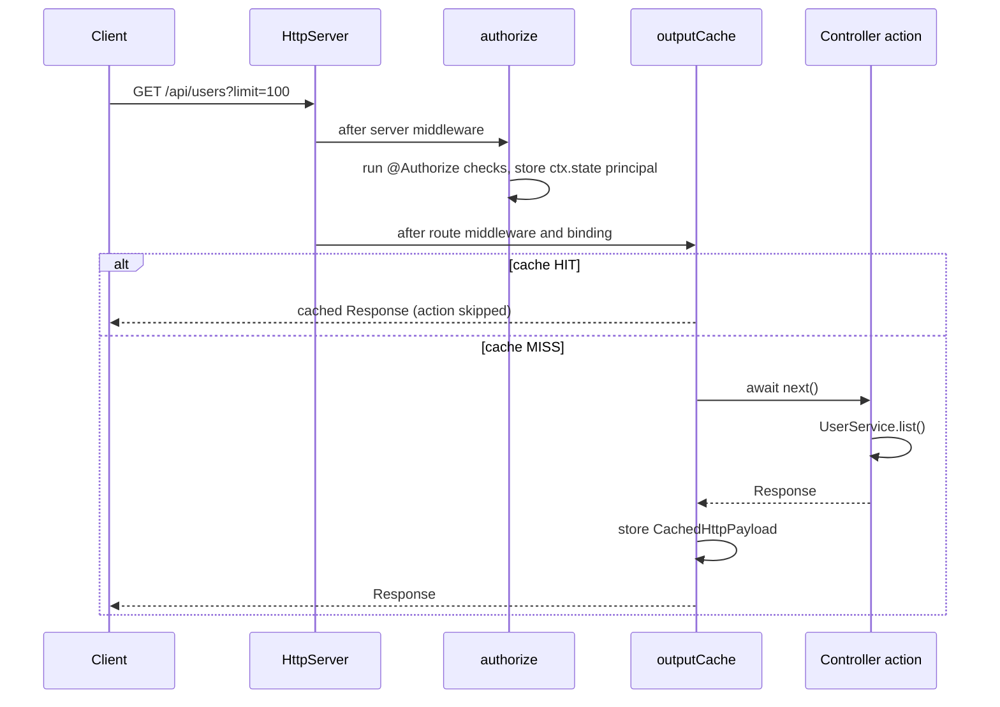
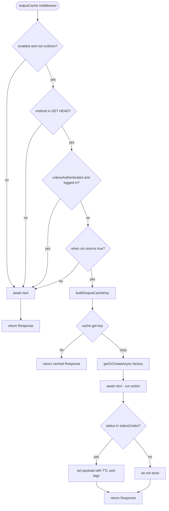
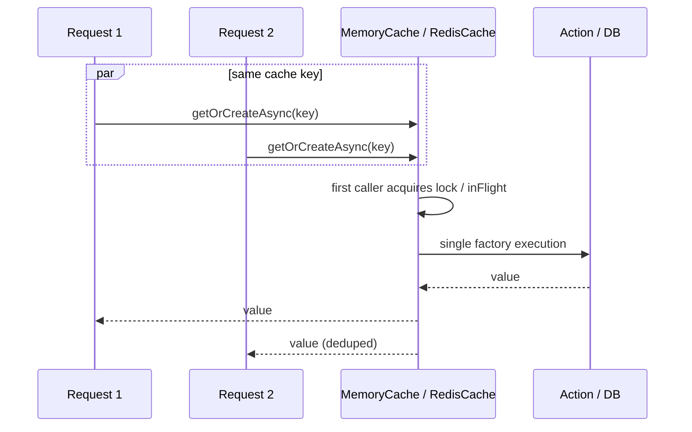
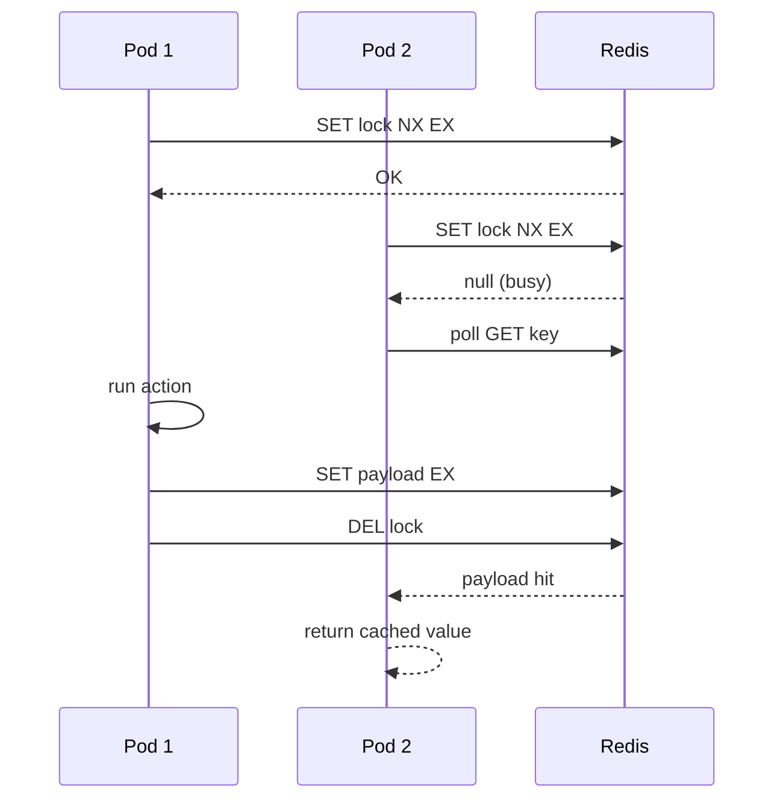

# The Cache module (`@/core/cache`): specification

In-memory and distributed (multi-instance) caching in the ASP.NET Core style:
`[OutputCache]` + `IMemoryCache` / `IDistributedCache`. Four decorators on two levels
(HTTP and services), no external npm dependencies, compatible with `bun build --compile`.

**Backend-agnostic:** the framework (`@/core/cache`) knows only the `IDistributedCache`
abstraction. A concrete backend (Redis and so on) lives in `@/core/infra/*` and is
enabled with `redisConnect(redisConfig, { cache: "distributed" })` in `@Infra`.
`@/core/cache` itself has no `import … from "bun"`/Redis at all.

Quick navigation:
- [1. What it is and why](#1-what-it-is-and-why)
- [2. Architecture: two levels × two backends](#2-architecture-two-levels--two-backends)
- [3. Quick start](#3-quick-start)
- [4. `memory()` / advanced cache module configuration](#4-memory--advanced-cache-module-configuration)
- [5. Named policies](#5-named-policies)
- [6. `@OutputCache` — HTTP output cache (memory)](#6-outputcache--http-output-cache-memory)
- [7. `@OutputRedisCache` — HTTP output cache (distributed)](#7-outputrediscache--http-output-cache-distributed)
- [8. `@Cacheable`: service method cache (memory)](#8-cacheable-service-method-cache-memory)
- [9. `@CacheableRedis`: service method cache (distributed)](#9-cacheableredis-service-method-cache-distributed)
- [10. DI providers: `cachedSingleton` / `cachedScoped` (+ auto-hook)](#10-di-providers-cachedsingleton--cachedscoped--auto-hook)
- [11. `ICache`: programmatic API](#11-icache-programmatic-api)
- [12. Output cache key building](#12-output-cache-key-building)
- [13. Anti-stampede and concurrent miss](#13-anti-stampede-and-concurrent-miss)
- [14. Tag invalidation](#14-tag-invalidation)
- [15. Integration with the HTTP pipeline](#15-integration-with-the-http-pipeline)
  - [15.1. Pipeline diagrams (Mermaid)](#151-pipeline-diagrams-mermaid)
- [16. The distributed backend and `@/core/infra`](#16-the-distributed-backend-and-coreinfra)
- [17. Security](#17-security)
- [18. Production scenarios](#18-production-scenarios)
- [19. Limits and anti-patterns](#19-limits-and-anti-patterns)
- [20. FAQ](#20-faq)
- [21. Folder map](#21-folder-map)

---

## 1. What it is and why

The module solves two different caching tasks:

| Task | Decorator | What is cached | .NET counterpart |
| --- | --- | --- | --- |
| **Output cache** | `@OutputCache` / `@OutputRedisCache` | the ready HTTP response (status + headers + body) | `[OutputCache]` |
| **Method cache** | `@Cacheable` / `@CacheableRedis` | the return value of a service method | `IMemoryCache` + `@Cacheable` |

**Why two levels:**

- **HTTP (output cache)**: the controller action ran once → repeated GET/HEAD are served without running the action and often without touching services/the database. Fits public catalog/list endpoints.
- **Service (method cache)**: the result of a business method is cached regardless of HTTP. Fits when one service is called from several controllers or background jobs, or when `@CacheableRedis` is needed across pods.

**Why memory and Redis:**

| Backend | Scope | When |
| --- | --- | --- |
| **In-memory** (`MemoryCache`) | one process | dev, single instance, `@Cacheable` by default |
| **Distributed** (`IDistributedCache`, a backend from `@/core/infra/*`) | all application instances | horizontal scaling, `@OutputRedisCache`, `@CacheableRedis` |

> "Redis" in the decorator names means "distributed level". The backend is connected
> separately; the core works with the `IDistributedCache` abstraction.

Public API import:

```ts
import {
  memory,
  OutputCache,
  OutputRedisCache,
  Cacheable,
  CacheableRedis,
  cachedScoped,
  ICache,
} from "@/core/cache";
import { composeRouteMiddlewareComposers } from "@/core/http";
import { redisConnect } from "@/core/infra";
```

---

## 2. Architecture: two levels × two backends

```
┌─────────────────────────────────────────────────────────────────┐
│                         HTTP Request                            │
└───────────────────────────────┬─────────────────────────────────┘
                                │
      authorize (@Authorize) → route middleware → binding → output cache
                                │
              ┌─────────────────┴─────────────────┐
              │                                   │
     @OutputCache (memory)         @OutputRedisCache (distributed)
              │                                   │
              ▼                                   ▼
         ICache<CachedHttpPayload>      DISTRIBUTED_OUTPUT_CACHE (registry)
              │                                   │
              └─────────────────┬─────────────────┘
                                │ cache HIT → response without the action
                                │ cache MISS → action → store payload
                                ▼
                         Controller action
                                │
                                ▼
                    Service (DI proxy)
              ┌─────────────────┴─────────────────┐
              │                                   │
         @Cacheable (memory)        @CacheableRedis (distributed)
              │                                   │
              ▼                                   ▼
            ICache                  DISTRIBUTED_SERVICE_CACHE (registry)
         (method return value)           ({prefix}svc:… keys)
```

### Four decorators: summary table

| Decorator | Level | Store | DI / HTTP wiring |
| --- | --- | --- | --- |
| `@OutputCache` | controller action | `ICache` in-memory | the cache module's `ROUTE_MIDDLEWARE_COMPOSER` registration (automatic) |
| `@OutputRedisCache` | controller action | `IDistributedCache` | the same + `redisConnect(config, { cache: "distributed" })` in Infra |
| `@Cacheable` | service method | `ICache` in-memory | `cachedSingleton` / `cachedScoped` (or the auto-hook) |
| `@CacheableRedis` | service method | `IDistributedCache` | `cachedSingleton` / `cachedScoped` + `redisConnect(config, { cache: "distributed" })` in Infra |

**Important:** put decorators on the **implementation class**, not on a TypeScript interface. DI registers the interface token → the proxy wraps the implementation.

### 2.1. Overview diagram (Mermaid)

```mermaid
flowchart TB
  subgraph HTTP["HTTP layer"]
    REQ[Request] --> GLOBAL[server middleware]
    GLOBAL --> AUTH[authorize @Authorize]
    AUTH --> ROUTE[route middleware + binding]
    ROUTE --> OC{output cache decorator?}
    OC -->|@OutputCache| MEM_OUT[(ICache memory)]
    OC -->|@OutputRedisCache| REDIS_OUT[(IDistributedCache)]
    OC -->|none| ACT[Controller action]
    MEM_OUT -->|HIT| RESP[Response]
    REDIS_OUT -->|HIT| RESP
    MEM_OUT -->|MISS| ACT
    REDIS_OUT -->|MISS| ACT
    ACT --> RESP
  end

  subgraph SVC["Service layer"]
    ACT --> SVC_CALL[Service method call]
    SVC_CALL --> CB{method decorator?}
    CB -->|@Cacheable| MEM_SVC[(ICache memory)]
    CB -->|@CacheableRedis| REDIS_SVC[(IDistributedCache svc:)]
    CB -->|none| IMPL[UserService impl]
    MEM_SVC -->|HIT| RET[return value]
    REDIS_SVC -->|HIT| RET
    MEM_SVC -->|MISS| IMPL
    REDIS_SVC -->|MISS| IMPL
    IMPL --> RET
  end
```

---

## 3. Quick start

### 3.1. Minimum: in-memory output + method cache

```ts
import { Cacheable, OutputCache, cachedScoped, memory } from "@/core/cache";
import { runApp } from "@/core/app";

await runApp(AppModule, {
  cache: memory(),
  http: { prefix: "api" },
});
```

Controller:

```ts
@Controller("products")
export class ProductsController {
  @Get("items")
  @OutputCache({ policy: "catalog" })
  list(limit = 20, page = 1) {
    return this.service.list(limit, page);
  }
}
```

Service:

```ts
class UserService implements IUserStore {
  @Cacheable({ policy: "userById", key: (...args) => String(args[0]) })
  async byId(id: number) {
    return this.users.find(id);
  }
}

// UsersModule:
providers: [
  cachedScoped(IUserStore, UserService, [repositoryFor(User)]),
],
```

### 3.2. With a distributed backend (multi-instance)

The backend is connected from `@/core/infra/*`; the framework stays backend-agnostic:

```ts
import { memory } from "@/core/cache";
import { Infra, redisConnect } from "@/core/infra";
import { runApp } from "@/core/app";
import { redisConfig } from "@/app/config/redis.config";
import { AppModule } from "@/app/modules/App.module";

@Infra({
  cache: redisConnect(redisConfig, { cache: "distributed" }),
})
class AppInfra {}

await runApp(AppModule, { cache: memory(), infra: AppInfra, http: {} });
```

```ts
@Get("items")
@OutputRedisCache({ policy: "catalog" })
list() { /* … */ }
```

```ts
class ProductService {
  @CacheableRedis({ seconds: 120, key: (...args) => String(args[0]), tags: ["products"] })
  async bySku(sku: string) { /* … */ }
}

// The same provider as for memory: the distributed level turns on
// automatically when Infra publishes the registry of distributed stores in DI.
cachedScoped(IProductService, ProductService, deps);
```

---

## 4. `memory()` / advanced cache module configuration

```ts
const module = memory({
  maxEntries?: number,
  maxInFlight?: number,
  defaultTtlSeconds?: number,
  maxKeyLength?: number,
  maxValueBytes?: number,
});

// Advanced internal builder used by hosting/infra integration:
const advanced = buildCacheModule({
  policies?: CachePolicyRegistry,
  outputCache?: CacheOutputCacheOptions,
  token?: typeof ICache,       // default ICache
  imports?: BazisModule[],
  healthCheck?: boolean,        // default true
});
```

### 4.1. `CacheOptions` — in-memory store

| Field | Type | Default | Description |
| --- | --- | --- | --- |
| `maxEntries` | `number` | ∞ | Max entries; LRU eviction on overflow |
| `maxInFlight` | `number` | `1024` | A positive safe integer. The limit of running factories; a new miss at the full limit throws `CacheCapacityError` before the factory starts |
| `defaultTtlSeconds` | `number` | — | The default TTL for `ICache.set` without an explicit `ttlSeconds` |
| `maxKeyLength` | `number` | `256` | Max key length; a longer key is rejected |
| `maxValueBytes` | `number` | ∞ | The value size limit (UTF-8 bytes); `set` throws when exceeded |

### 4.2. `CacheOutputCacheOptions`

| Field | Type | Default | Description |
| --- | --- | --- | --- |
| `enabled` | `boolean` | `true` | The global switch of the HTTP output cache |
| `insecureAuthorizedRouteBehavior` | `"throw" \| "warn" \| "ignore"` | `"throw"` | The policy for an `@Authorize` route without per-user isolation |
| `requireAuthenticationByDefault` | `boolean` | `false` | Treat every route without `@AllowAnonymous` as protected in that check (for applications that authenticate every route) |

### 4.3. Distributed stores

Connection: `redisConnect(redisConfig, { cache: "distributed" })` in `@Infra`.
The connector publishes `DistributedCacheStores` and the HTTP/service registries through
DI. The cache module takes the policies and the memory/output cache settings; Infra
manages the external backend's resources. Redis parameters are in §16.

### 4.4. What the module registers

| Token / service | Purpose |
| --- | --- |
| `ICache` | the `MemoryCache` singleton |
| `CACHE_OPTIONS` | validated options |
| `CACHE_POLICIES` | named policies from the config |
| `HEALTH_CHECK` | `cache:memory` |

Infra separately publishes `DISTRIBUTED_CACHE_BACKEND`, `DISTRIBUTED_OUTPUT_CACHE`,
`DISTRIBUTED_SERVICE_CACHE`, its lifecycle and the connection health.

---

## 5. Named policies

Policies are reusable presets in `buildCacheModule({ policies })`. A decorator refers to one with `policy: "name"`.
Inline decorator fields **override** the policy (policy → inline, inline wins).

```ts
buildCacheModule({
  policies: {
    catalog: {
      seconds: 60,
      varyByQuery: ["limit", "page"],
      tags: ["catalog"],
      clientCache: { public: true, maxAge: 30 },
    },
    userById: {
      seconds: 300,
      tags: ["users"],
      key: (...args) => `user:${String(args[0])}`, // for @Cacheable
    },
  },
});
```

```ts
@OutputCache({ policy: "catalog" })
@Cacheable({ policy: "userById" })
```

The `CachePolicy` type combines the output cache and method cache fields: one policy can be used on both levels (extra fields are ignored on the other level).

---

## 6. `@OutputCache` — HTTP output cache (memory)

Caches the **full HTTP response** after the action runs. On a cache hit the controller is **not called**.

### 6.1. Field reference

#### Common (`CachePolicyBase`)

| Field | Type | Default | Description |
| --- | --- | --- | --- |
| `seconds` | `number` | — | **Required** (inline or in the policy). The entry TTL |
| `policy` | `string` | — | A policy name from `buildCacheModule({ policies })` |
| `tags` | `string[]` | — | Tags for `ICache.evictByTag(tag)` |
| `enabled` | `boolean` | `true` | `false`: the middleware is not attached (the metadata is kept) |
| `noStore` | `boolean` | `false` | `true`: neither read nor write the cache |

#### HTTP-specific (`OutputCachePolicyFields`)

| Field | Type | Default | Description |
| --- | --- | --- | --- |
| `varyByQuery` | `string[]` \| `"*"` | `"*"` | Query parameters in the key. `[]` explicitly ignores the query |
| `varyByRoute` | `string[]` | — | Route params (`:id`, …) in the key |
| `varyByHeader` | `string[]` | — | Request header values in the key |
| `varyByUser` | `boolean` | `false` | A separate key per principal `subject` (an `@Authorize` check stores the principal; authorization runs before the cache) |
| `varyByClaim` | `string` | — | A separate key per claim value (for example role) |
| `maxBodyBytes` | `number` | `16777216` | The max body materialized for one entry; `0` explicitly disables the limit |
| `bodyReadTimeoutMs` | `number` | `5000` | The overall body materialization timeout; `0` explicitly disables the timeout |
| `unlessAuthenticated` | `boolean` | `false` | `true`: do not cache for signed-in users |
| `allowAuthenticatedShared` | `boolean` | `false` | Explicitly allow a shared entry for an optional-auth request if the response does not depend on the principal |
| `methods` | `string[]` | `GET`, `HEAD` | The HTTP methods the cache works for |
| `statusCodes` | `number[]` | `[200]` | Which status codes to store |
| `clientCache` | `ClientCacheOptions` | — | `Cache-Control` for the browser/CDN (the Response Cache layer) |
| `when` | `(ctx) => boolean \| Promise<boolean>` | — | `false` → skip read/write |

If the body exceeds `maxBodyBytes` or does not materialize within `bodyReadTimeoutMs`,
the response goes to the client unchanged but does not get into the cache.

#### `ClientCacheOptions`

| Field | Type | Description |
| --- | --- | --- |
| `maxAge` | `number` | `max-age=N` in `Cache-Control` |
| `public` | `boolean` | the `public` directive |
| `private` | `boolean` | the `private` directive |
| `noCache` | `boolean` | the `no-cache` directive |

For `varyByUser`/`varyByClaim` the client policy always becomes `private`;
`clientCache.public: true` together with personalization is a startup error.

### 6.2. Examples

**A public catalog with pagination:**

```ts
@Get("items")
@OutputCache({
  seconds: 120,
  varyByQuery: ["limit", "page"],
  tags: ["catalog"],
  clientCache: { public: true, maxAge: 60 },
})
list(limit = 20, page = 1) {
  return this.repo.list(limit, page);
}
```

**A protected list isolated per user:**

```ts
@Controller("users")
@Authorize()
export class UsersController {
  @Get()
  @OutputCache({ policy: "users" })
  // policy: { seconds: 30, varyByQuery: ["limit"], varyByUser: true, tags: ["users"] }
  list(limit = 100) { /* … */ }
}
```

**Conditional caching:**

```ts
@Get("report")
@OutputCache({
  seconds: 300,
  when: (ctx) => ctx.url.searchParams.get("preview") !== "1",
})
report() { /* … */ }
```

**Only for anonymous users:**

```ts
@Get("landing-stats")
@OutputCache({ seconds: 60, unlessAuthenticated: true })
stats() { /* one cache for all guests; signed-in users always get fresh data */ }
```

### 6.3. What is stored in the cache

The response is serialized as a `CachedHttpPayload`:

```ts
{ status: number; headers: Record<string, string>; body: Uint8Array }
```

Sensitive response headers are **neither stored nor replayed**:
`Set-Cookie`, `Authorization`, `Cookie`, `WWW-Authenticate`, `Proxy-Authenticate`, `Proxy-Authorization`.

The body is read whole (`arrayBuffer`): **streaming responses are not supported**.

---

## 7. `@OutputRedisCache` — HTTP output cache (distributed)

The semantics are identical to `@OutputCache`; the store is the distributed `IDistributedCache`.
It is shared by all application instances with one backend.

### 7.1. Extra fields

| Field | Type | Default | Description |
| --- | --- | --- | --- |
| `connection` | `string` | `"default"` | The backend connection name |
| `keyPrefix` | `string` | from the connection | An extra key prefix for **this route** |
| `lockSeconds` | `number` | from the connection | Overrides the TTL of the anti-stampede lock on a miss |

Inherits all `@OutputCache` fields (see §6.1).

### 7.2. Connection

```ts
import { Infra, redisConnect } from "@/core/infra";
import { redisConfig } from "@/app/config/redis.config";

@Infra({
  cache: redisConnect(redisConfig, { cache: "distributed" }),
})
class AppInfra {}
```

```ts
@Get("feed")
@OutputRedisCache({ seconds: 30, connection: "analytics", varyByQuery: ["cursor"] })
feed() { /* … */ }
```

### 7.3. Pipeline (Redis)

```
MISS:
  GET key → miss
  SET lock:{key} NX EX lockSeconds
  → run action (one pod)
  → SET payload EX seconds
  → SADD tag:{tag} payloadKey

HIT:
  GET key → deserialize CachedHttpPayload → Response
```

Concurrent miss:
- **on one pod**: in-process `inFlight` dedup;
- **between pods**: `SET NX EX` + polling for the peer result up to `lockSeconds`.

### 7.4. Limits

- Without the `DISTRIBUTED_OUTPUT_CACHE` DI registry, the first request to a route with `@OutputRedisCache` gets a `CacheError`.
- `@OutputCache` + `@OutputRedisCache` on one action is a **warning**; the distributed one wins.
- The connection must be ready before the first request: `InfraLifecycle` connects Redis, default phase −100.

---

## 8. `@Cacheable`: service method cache (memory)

Intercepts the method call through the DI proxy. The **return value** is cached (an object reference).

### 8.1. Field reference

| Field | Type | Default | Description |
| --- | --- | --- | --- |
| `seconds` | `number` | — | **Required** (inline or in the policy) |
| `policy` | `string` | — | A named policy |
| `tags` | `string[]` | — | Tag invalidation |
| `enabled` / `noStore` | `boolean` | — | As in the output cache |
| `key` | `string` \| `(...args) => string` | auto | The entry key. Without `key`: SHA-256 of the class/method and the canonical argument graph; unsupported input bypasses the cache |
| `unless` | `(...args) => boolean` | — | `true` → skip the cache for this call |

### 8.2. Examples

The automatic key supports primitives, regular arrays, a standard Date, Map/Set without
extra properties and records with the Object.prototype/null prototype and enumerable
string data fields. Map/Set are walked with the built-in iterators in insertion order;
nested collections are supported. Record fields are still sorted. The graph of the whole
argument list distinguishes a repeated reference from equal copies. Object keys of a Map
and Set elements get a stable identity within the service proxy, including their
occurrences in other arguments. The encoder UUID distinguishes such identities even for
different proxies with a shared cacheNamespace. So `map.has(knownObject)` is not mixed up
with looking up another equal object. The graph content is recomputed on every call;
mutations affect the next key.

For classes with hidden state, subclasses of built-in types, accessors,
functions/symbols, symbol/non-enumerable fields, extra properties of built-in objects,
cycles, Proxy and an invalid Date, the wrapper automatically calls the original method
without the cache. The method is called once, both backends and the distributed registry
are not touched; the encoder runs no getters/Proxy traps. This needs no explicit `key`.
Errors of the method, an explicitly set `key` and the backend are not suppressed.
For CacheableRedis a missing backend is checked after deciding to use the cache.

Regular records/arrays stay data by value: the field order of a record, the descriptor
flags and the arbitrary external identity of nested objects are not part of the key.
Arguments are not frozen: the key is a snapshot at entry, so do not change the data of an
unfinished operation. For other equivalence semantics set an application `key`. Getters
and setters of the cached service itself run on the original instance and support native
private fields.

```ts
class UserService implements IUserStore {
  @Cacheable({
    seconds: 300,
    key: (...args: readonly unknown[]) => `user:${String(args[0])}`,
    tags: ["users"],
  })
  async byId(id: number) {
    return this.users.find(id);
  }

  @Cacheable({
    policy: "userById",
    unless: (id: unknown) => Number(id) < 0,
  })
  async byIdWithPolicy(id: number) { /* … */ }
}
```

**The `key` is always `(...args: readonly unknown[]) => string`** (a TypeScript constraint of the proxy).

### 8.3. Class-level vs method-level

```ts
@Cacheable({ seconds: 60, tags: ["reports"] })
class ReportService {
  daily() { /* cached — inherits class metadata */ }
  live() { /* cached — unless overridden */ }

  @Cacheable({ seconds: 5 })
  live() { /* method metadata overrides class for this method */ }
}
```

---

## 9. `@CacheableRedis`: service method cache (distributed)

A method cache shared between instances. Values are serialized as **JSON** (`jsonCacheCodec`).

### 9.1. Fields

All `@Cacheable` fields (§8.1) plus:

| Field | Type | Default | Description |
| --- | --- | --- | --- |
| `connection` | `string` | `"default"` | The distributed connection name |
| `lockSeconds` | `number` | from the connection | The distributed lock TTL |

### 9.2. Key namespace

| Store | Key pattern |
| --- | --- |
| HTTP output (codec payload) | `{keyPrefix}{routeKey}` |
| Service (codec JSON) | `{keyPrefix}svc:{methodKey}` |

The HTTP and service caches **do not overlap** even with one connection.

### 9.3. A hybrid class example

```ts
class UserService implements IUserStore {
  @Cacheable({ policy: "userById", key: (...args) => String(args[0]) })
  async byId(id: number) { /* memory: a fast local cache */ }

  @CacheableRedis({ policy: "userByName", key: (...args) => String(args[0]) })
  async findByName(name: string) { /* Redis: a lookup shared across pods */ }
}
```

**One method, one decorator.** `@Cacheable` + `@CacheableRedis` on one method → a runtime error.

---

## 10. DI providers: `cachedSingleton` / `cachedScoped` (+ auto-hook)

One provider covers both levels. `@Cacheable` → the in-memory `ICache`; `@CacheableRedis` →
the distributed `DISTRIBUTED_SERVICE_CACHE`, **automatically** if the registry is
registered through Infra/DI. There are no separate `redisCached*` / `hybridCached*` anymore.

| Provider | Decorators | DI dependencies | Scope |
| --- | --- | --- | --- |
| `cachedSingleton` | `@Cacheable` and/or `@CacheableRedis` | `ICache`, `CACHE_POLICIES`, (optional) `DISTRIBUTED_SERVICE_CACHE` | singleton |
| `cachedScoped` | `@Cacheable` and/or `@CacheableRedis` | the same | scoped |

Removed aliases: `src/bazis/core/cache/COMPATIBILITY.md`.

```ts
// Interface token ← proxy ← implementation class with decorators.
// Works for both @Cacheable and @CacheableRedis (if the backend is configured).
cachedScoped(IUserStore, UserService, [repositoryFor(User)]);
```

### 10.0. Out of the box (auto-hook)

`memory()` registers a hook on the core `singleton()` / `scoped()` providers: if a class
carries `@Cacheable` / `@CacheableRedis`, the regular registration is **automatically**
wrapped with a caching proxy. An explicit `cachedScoped` is needed only when you want to
be completely explicit.

### 10.1. Interface vs implementation: a common question

```ts
interface IUserStore {
  byId(id: number): Promise<User | undefined>;
}

class UserService implements IUserStore {
  @Cacheable({ seconds: 60, key: (...args) => String(args[0]) })
  async byId(id: number) { /* … */ }
}

// ✅ correct
cachedScoped(IUserStore, UserService, deps);

// ❌ a decorator on an interface does not work
// With memory() connected, a plain singleton(IUserStore, UserService)
// also gets the proxy through the auto-hook.
```

### 10.2. Module encapsulation

The application must install the cache module once with `runApp(AppModule, { cache: memory() })`
or a root import of `memory()`. A feature module registers only its own service:

```ts
@Module({
  imports: [UsersDataModule],
  providers: [cachedScoped(IUserStore, UserService, deps)],
})
class UsersModule {}
```

---

## 11. `ICache`: programmatic API

Direct use without decorators (invalidation, custom cache logic):

```ts
constructor(private readonly cache: ICache) {}

// a sync/async factory with dedup
const value = await this.cache.getOrCreateAsync(
  "config:features",
  () => this.loadFeatures(),
  { ttlSeconds: 300, tags: ["config"] },
);

// group cleanup
this.cache.evictByTag("users");
```

| Method | Description |
| --- | --- |
| `get(key)` | Reads an entry; `undefined` if it is missing or the TTL expired |
| `set(key, value, options?)` | Writes; **throws** when limits are violated |
| `getOrCreate(key, factory, options?)` | A sync/async factory; dedup if the factory returned a Promise |
| `getOrCreateAsync(key, factory, options?)` | Async + in-process anti-stampede |
| `remove(key)` | Removes one entry |
| `clear()` | Clears the whole store |
| `evictByTag(tag)` | Removes all entries with the tag |
| `list()` / `size` | Introspection (without expired entries) |

`getOrCreate*` does not throw on value-size overflow: graceful degradation (the value is returned but may not be stored). The `maxInFlight` limit is the exception: a new miss at the full limit gets `CacheCapacityError`.

Direct `ICache` keys longer than `maxKeyLength` (default 256) are rejected.
The built-in HTTP/service key builders hash a canonical representation with SHA-256 before writing.

---

## 12. Output cache key building

The `buildOutputCacheKey(ctx, routeName, options)` function builds a JSON tuple that
always includes the HTTP method, the action identity, the request `origin` and the actual
`pathname`, then returns `http:<sha256>`. Raw query/header/user values never get into the keyspace.

```
http:<sha256(JSON tuple)>
```

| Vary option | Tuple component | Example |
| --- | --- | --- |
| `varyByQuery: ["limit"]` | `["query","limit",["20"]]` | all repeated values of the named params |
| `varyByQuery: "*"` | all query names sorted | each name + all its values |
| `varyByRoute: ["id"]` | `["route","id","42"]` | |
| `varyByHeader: ["Accept-Language"]` | `["header","accept-language","ru"]` | the header name lowercased |
| `varyByUser: true` | auth state + `sub` | an empty authenticated `sub` disables the cache for the request |
| `varyByClaim: "role"` | auth state + claim type/value | an empty claim disables the cache for the request |
| API version | `["version","2"]` | if `ctx.apiVersion` is set |

An example of the final key:

```
http:8f5d…<64 hex chars>
```

---

## 13. Anti-stampede and concurrent miss

**The problem:** 100 concurrent misses on one key → 100 identical database queries.

**The solution:**

| Store | Mechanism |
| --- | --- |
| Memory (`MemoryCache`, output + `@Cacheable`) | the `inFlight` Map: one factory per key in the process |
| Redis output / `@CacheableRedis` | `SET lock NX EX` + in-process dedup + polling the peer |

If the Redis lock is not acquired, the instance waits for the peer pod's result (polling every 50 ms up to `lockSeconds`).

---

## 14. Tag invalidation

```ts
@OutputCache({ seconds: 300, tags: ["catalog", "products"] })
@Cacheable({ seconds: 300, tags: ["users"] })
```

```ts
import { DISTRIBUTED_OUTPUT_CACHE, DISTRIBUTED_SERVICE_CACHE } from "@/core/cache";

// After a data mutation:
cache.evictByTag("catalog");   // memory output + method cache

// The distributed level (resolve the registry from DI):
await services.resolve(DISTRIBUTED_OUTPUT_CACHE).resolve("default").evictByTag("catalog");
await services.resolve(DISTRIBUTED_SERVICE_CACHE).resolve("default").evictByTag("users");
```

The backend keeps the tag index as a SET: `SADD tag:{tag} memberKeys` (+ `EXPIRE` for the entry TTL)
→ `SMEMBERS` + `DEL` on evict. The SET has a TTL, so the tag index does not grow without bound.

**Note:** invalidation is **not automatic**: the application calls `evictByTag` after POST/PUT/DELETE (like `IOutputCacheStore.EvictByTagAsync` in ASP.NET).

---

## 15. Integration with the HTTP pipeline

The order on a route with `@Authorize` and an output cache:

```
1. server middleware        ← httpModule({ middleware }) + DI SERVER_MIDDLEWARE
2. authorize                ← built-in @Authorize / @AllowAnonymous check
3. route middleware         ← controller and method @Middleware
4. binding + ActionFilter.before
5. outputCache              ← route composer from the cache module (DI)
6. controller action
```

Connection: installing the cache module is enough. `memory()` (or `buildCacheModule(...)`) registers the output cache composer through the `ROUTE_MIDDLEWARE_COMPOSER` DI token, and `httpModule` picks it up:

```ts
await runApp(AppModule, {
  cache: memory(),            // registers the output cache ROUTE_MIDDLEWARE_COMPOSER
  http: {},
});
```

No manual `routeMiddlewareComposer` wiring is needed; an explicit
`httpModule({ routeMiddlewareComposer })` is combined with the DI composers.

**Authorization before the cache** is built into the route chain: for `varyByUser` / `varyByClaim` the `@Authorize` check must store the principal in `ctx.state` (`PRINCIPAL_STATE_KEY`) before the key is built.

On a **cache hit** step 6 does not run: the response is faster in the HTTP logs, and there are no action side effects.

### 15.1. Pipeline diagrams (Mermaid)

#### Middleware order



#### Output cache — decision flow



#### Concurrent miss (anti-stampede)



#### Redis distributed lock (between pods)



#### `@Cacheable` proxy (service layer)

```mermaid
flowchart LR
  CTRL[Controller] -->|resolve IUserStore| PROXY[Cacheable Proxy]
  PROXY --> META{@Cacheable on method?}
  META -->|no| BIND[bind original method]
  META -->|yes| KEY[build key from args]
  KEY --> G{ICache.get}
  G -->|hit| RET1[return cached value]
  G -->|miss| CALL[call UserService method]
  CALL --> SET[ICache.set with TTL]
  SET --> RET2[return fresh value]
```

---

## 16. The distributed backend and `@/core/infra`

### Responsibility and contracts

`DistributedCache` owns TTL, tags, the fencing lock, request coalescing and value limits.
`DistributedCacheDriver` implements the low-level commands; for Redis that is
`RedisDistributedCacheDriver` from Infra.
`DistributedCacheStores` provides the names, the HTTP/service registries and `ping()`
without managing the connection. `RedisDistributedCacheBackend` builds these registries on
top of the client owned by `redisConnect` and its `InfraLifecycle`.

The contract and the DI token `DISTRIBUTED_CACHE_BACKEND` use `DistributedCacheStores`.
It is available through the public Cache API and has no lifecycle methods.
The Redis backend has no `start/stop` either: the connection and health belong to the
Redis connector. Cache does not register the backend as a HostedService.

### A single backend

An application allows one unkeyed `DISTRIBUTED_CACHE_BACKEND` registration.
When the module container is built, Cache checks the final registrations after configure.
Two backends, even with different `connection` values or in different modules, give a
`CacheError` before clients are created; the order of imports does not pick a winner.
The shared HTTP/service registries belong to the one chosen backend.
DI handles a repeated import of the same module once; separate containers do not conflict.
An explicit replacement through `configure.replace` is counted by its result.
The check works in `createContainer`/kernel, not in a standalone ServiceCollection.

One `redisConnect(config, { cache: ... })` provides one named connection. Other Redis
clients are allowed with separate `token` values without the cache mode.
A custom backend may provide several names through NamedCacheRegistry; there is no
automatic merging of several backends and no `connections` field in `redisConnect`.

### Redis parameters

The `config` declaration holds the required `url: string | Secret`. The connector's second
argument takes `token?` and `cache?: "distributed" | { mode: "distributed", ...tuning }`.
Without a cache mode only the client is registered. Tuning is optional:

| Field | Type | Default | Description |
| --- | --- | --- | --- |
| `connection` | `string` | `default` | The name for decorators and NamedCacheRegistry |
| `keyPrefix` | `string` | `bazis:cache:` | A shared prefix; the backend adds `out:` and `svc:` |
| `defaultLockSeconds` | `number` | `10` | A positive finite lock time, seconds |
| `maxKeyLength` | `number` | `512` | A positive integer, the key length |
| `maxValueBytes` | `number` | No limit | A positive integer; the limit of a serialized value |
| `pollIntervalMs` | `number` | `50` | A positive finite interval for waiting for a result, ms |

The connector reads the `defineConfig` view of its kernel. Env overrides follow the
kernel/config rules and the application declaration; generic `REDIS_URL`/`REDIS_KEY_PREFIX`
are not read automatically.

### Startup and shutdown

`InfraLifecycle` creates the client lazily and publishes it through DI. The backend and the
registries may be resolved before start; I/O is allowed once the connection is ready. At
start Infra calls `RedisClient.connect()` (default phase −100), and on an error or at
shutdown `close()` exactly once. The backend neither opens nor closes the client. Reusing a
stopped kernel is not supported.

### Lock atomicity (fencing) and health

The lock is taken with `SET lock token NX EX`. Release is an atomic Lua `compare-and-del`
(`if get==token then del`); a slow worker cannot delete someone else's lock.

`cache:memory` shows the entries. The Infra Redis path registers `infra:<name>` with a real
PING. A custom connector defines its own connection check.
Without a distributed backend the memory operations are available; `@OutputRedisCache` and
`@CacheableRedis` need the matching DI registries.

Composition checks: [cache-composition.test.ts](../infra/test/cache-composition.test.ts).
Algorithm checks with a stub driver do not replace physical Redis acceptance.

---

## 17. Security

### 17.1. Startup guard

At HTTP startup the module checks: `@OutputCache` / `@OutputRedisCache` on a route with `@Authorize` (or with `requireAuthenticationByDefault`) **without** `varyByUser: true` and **without** `unlessAuthenticated: true` → a fail-fast error by default:

```
[cache] @OutputCache on UsersController.list is on an authorized route
without varyByUser or unlessAuthenticated — …
```

For a migration you can temporarily enable the warning mode:
`buildCacheModule({ outputCache: { insecureAuthorizedRouteBehavior: "warn" } })`.
Disabling it fully (`"ignore"`) is acceptable only with an external security policy.

### 17.2. Recommendations by scenario

| Scenario | Recommendation |
| --- | --- |
| A public GET catalog | `@OutputCache({ seconds: 60, varyByQuery: [...] })` |
| A protected per-user list | `varyByUser: true` |
| Shared stats only for guests | `unlessAuthenticated: true` |
| Personal data | `@Cacheable` in the service with an explicit `key`, not the output cache |
| A multi-instance public API | `@OutputRedisCache` |
| An auth lookup shared between pods | `@CacheableRedis` on `findByName` or similar |

### 17.3. What must not be cached through the output cache

- Responses with `Set-Cookie` (session establishment)
- Streaming / chunked responses
- Personal data without `varyByUser`
- Mutating methods (POST/PUT/DELETE): not cached by default (`methods: GET, HEAD`)

---

## 18. Production scenarios

In the osnova application the composition root is `src/index.ts` + `src/app/infra/App.infra.ts`:

```ts
import { memory } from "@/core/cache";
import { Infra, redisConnect } from "@/core/infra";
import { redisConfig } from "@/app/config/redis.config";

@Infra({
  cache: redisConnect(redisConfig, { cache: "distributed" }),
})
class AppInfra {}

await runApp(AppModule, {
  infra: AppInfra,
  cache: memory(),
  http: { port: 3000, prefix: "api" },
});
```

**Service** (one and the same provider for memory and distributed):

```ts
class UserService implements IUserStore {
  @Cacheable({ policy: "userById", key: (...args) => String(args[0]) })
  async byId(id: number) { /* … */ }

  @CacheableRedis({ policy: "userByName", key: (...args) => String(args[0]) })
  async findByName(name: string) { /* … */ }
}

// UsersModule:
imports: [UsersDataModule],
providers: [cachedScoped(IUserStore, UserService, deps)],
```

`@CacheableRedis.findByName` uses the distributed level automatically when the backend is
configured; without a backend such a call throws a clear error (see §19).

### Checking the output cache (manual)

1. `GET /api/users?limit=100` with a JWT → a list of N users
2. `POST /api/users` → create a new one
3. A repeated `GET /api/users?limit=100` → **still N** (stale until the TTL expires / evictByTag)

Run these steps against a running application or its built binary.

---

## 19. Limits and anti-patterns

### v1 limits

| # | Limit |
| --- | --- |
| 1 | `@OutputCache` / `@Cacheable`: one process (not shared) |
| 2 | `@CacheableRedis` values are JSON-serializable only (Date → string, class instances lose their prototype) |
| 3 | `@Cacheable` / `@CacheableRedis` without an explicit `key` encode supported data and Map/Set per §8.2; unsupported arguments, including cycles and hidden state, automatically bypass the cache |
| 4 | **References** to objects are cached in memory: mutating after get changes the "cache" |
| 5 | The output cache materializes the full body within `maxBodyBytes`/`bodyReadTimeoutMs`; large or slow streams are served without the cache |
| 6 | Tag invalidation is manual (`evictByTag`), not tied to ORM events |
| 7 | No `@CacheEvict` decorator (invalidate explicitly in code) |
| 8 | The Redis backend is only Bun's built-in `RedisClient` (another backend is your own `DistributedCacheDriver`) |

**What improved in this version:**

- The distributed lock is released atomically (fencing-token Lua `compare-and-del`): no Redlock bug.
- `maxValueBytes` applies both to the distributed level and to binary values (the output payload).
- `MemoryCache.size` is O(1) (no full scan on every access).
- InfraLifecycle releases the client on a connection error; the coordinator rolls back services that already started.
- The Redis connector's `infra:<name>` health check does a real `PING`.
- One caching proxy (`wrapCachedService`) for both levels: no duplication and no fake `ICache`.

### Anti-patterns

```ts
// ❌ A decorator on an interface
interface IUserStore {
  @Cacheable({ seconds: 60 }) // does not work
  byId(id: number): Promise<User>;
}

// ✅ A regular singleton/scoped: the auto-hook wraps a class with @Cacheable/@CacheableRedis
singleton(IUserStore, UserService); // the proxy applies automatically (memory() is connected)

// ❌ @OutputRedisCache without distributed stores in Infra/DI
memory({}); // + @OutputRedisCache → CacheError on the first request

// ❌ Both output decorators on an action
@OutputCache({ seconds: 60 })
@OutputRedisCache({ seconds: 60 }) // warning, the distributed one wins

// ❌ Both method decorators on one method
@Cacheable({ seconds: 10 })
@CacheableRedis({ seconds: 10 }) // runtime throw

// ❌ Output cache of personal data without varyByUser
@Authorize(isSignedIn)
@OutputCache({ seconds: 60 }) // startup throw + data leak risk
```

---

## 20. FAQ

### `@OutputCache` or `@Cacheable`: which one?

| Criterion | `@OutputCache` | `@Cacheable` |
| --- | --- | --- |
| Caches | the whole HTTP response | the method return value |
| Level | controller | service |
| Vary by query/header/user | ✅ | ❌ (only a `key` from args) |
| Client `Cache-Control` | ✅ `clientCache` | ❌ |
| Reuse outside HTTP | ❌ | ✅ (jobs, other controllers) |
| Streaming response | ❌ | ✅ (the method may stream, but the value cache does not) |

**Rule:** a public GET endpoint → `@OutputCache`. A method called from several places, or a cache needed without HTTP → `@Cacheable`.

---

### `@OutputCache` or `@OutputRedisCache`?

| | Memory | Redis |
| --- | --- | --- |
| Instances | 1 process | N pods |
| Dependencies | only `memory()` | + `redisConnect(config, { cache: "distributed" })` in `@Infra` |
| Latency | ~μs | ~ms (network) |
| Eviction tags | in-process | shared in Redis |

One pod / dev → `@OutputCache`. Production horizontal scale + the same GET for everyone → `@OutputRedisCache`.

Separate decorators (not `provider: "redis"` in options): the store is explicit in the metadata, easier to grep and fail-fast without a Redis config.

---

### I put `@Cacheable` on a service, but the cache does not work

Checklist:

1. The decorator is on the **class `UserService`**, not on `interface IUserStore`.
2. The root app installs `cache: memory()` or imports `memory()` (auto-hook + `ICache`, `CACHE_POLICIES`).
3. The registration goes through `singleton`/`scoped` (the auto-hook wraps it) or explicitly `cachedScoped`/`cachedSingleton`.
4. The options have **`seconds`** (inline or in the `policy`).
5. For `@CacheableRedis`, infra connects `redisConnect(redisConfig, { cache: "distributed" })`, otherwise the call throws.

---

### The controller injects an interface: does the cache on the implementation work?

**Yes**, if:

```ts
// UserService.ts: the decorator is here
@Cacheable({ seconds: 60 })
async byId(id: number) { ... }

// UsersModule.ts: registration on the interface token
cachedScoped(IUserStore, UserService, deps);
```

The controller gets the proxy registered as `IUserStore`. The metadata is read from the `UserService` class (`Symbol.metadata`), not from the interface.

---

### What is `varyByQuery`?

Query parameters take part in the **cache key**. Requests with different values are different entries:

```
GET /items?limit=20  → http:<digest A>
GET /items?limit=50  → http:<digest B>  (a separate cache entry)
```

`varyByQuery: "*"` means all query params (sorted), and it is the secure default.
Only an explicit `varyByQuery: []` ignores the query for a response proven to be query-independent.

---

### After a POST the GET data did not update: is it a bug?

**No**, if you did not call `evictByTag`. The output cache keeps a snapshot of the response until the TTL expires.

```ts
await this.users.add(dto);
await this.cache.evictByTag("users"); // or ICache from DI after the mutation
```

A manual check: after a POST the new record is not visible in the cached list until `evictByTag` or the TTL.

---

### Is there an `X-Cache: HIT` header?

**No** in v1. Signs of a hit:

- a repeated request is faster in the HTTP logs;
- controller side effects do not fire (the stale data test);
- `ICache.size` grows after the first miss.

---

### Can `@OutputCache` and `@OutputRedisCache` be on one action?

Technically yes, but **do not**: a startup warning, and Redis wins. Pick one store.

---

### Can `@Cacheable` and `@CacheableRedis` be on one method?

**No**: a runtime error. On **different** methods of one class use a regular `cachedScoped` (one proxy routes memory and distributed).

---

### `cachedSingleton` or `cachedScoped`?

| | singleton | scoped |
| --- | --- | --- |
| Proxy instance | one per DI registration in the container | one per DI registration in the scope |
| `@Cacheable` cache | the shared ICache store, automatic keys are isolated per instance | the same ICache store, automatic keys are isolated per instance |
| ORM `DbContext` | ⚠️ careful | ✅ the typical case |

A `UserService` with an ORM → **`cachedScoped`**. A stateless read-only service without scoped deps → `cachedSingleton` is fine.
An explicit `key` in `cachedScoped` and `cachedSingleton` is a sharing contract: include the
tenant/user in it if the result is personalized. Without an explicit `key` the framework
isolates the automatic key per instance, so hidden constructor state does not leak into the
response of another registration or request. This also applies to `@CacheableRedis`:
sharing between processes and reuse after a restart need an explicit application `key`.
DI creates the object with a regular class provider and then applies the proxy;
constructor deps and lifecycle are not bypassed.

---

### Is Redis needed for the application to work?

**No.** Without a backend `@OutputCache` + `@Cacheable` (memory) work. `@OutputRedisCache`
throws a CacheError on the first request, and `@CacheableRedis` on a method call, if the
distributed stores are not registered through Infra/DI. The usual connection:
`redisConnect(config, { cache: "distributed" })` in `infraModule`.

---

### How to invalidate the cache after an update?

```ts
import { ICache, DISTRIBUTED_OUTPUT_CACHE, DISTRIBUTED_SERVICE_CACHE } from "@/core/cache";

// memory output + @Cacheable
cache.evictByTag("users");

// distributed HTTP output / service cache (resolve the registry from DI):
await services.resolve(DISTRIBUTED_OUTPUT_CACHE).resolve("default").evictByTag("catalog");
await services.resolve(DISTRIBUTED_SERVICE_CACHE).resolve("default").evictByTag("users");
```

Automatic invalidation on ORM `saveChanges` is **not implemented** (v1).

---

### Is it compatible with `bun build --compile`?

**Yes.** Metadata goes through TC39 decorators (`Symbol.metadata`), without runtime reflection npm packages.
The `@/core/cache` core does not import Redis at all; the backend lives in `@/core/infra/cache`
and is connected through `redisConnect(...)`.

---

### Where is a working example?

| File | What |
| --- | --- |
| `src/app/infra/App.infra.ts` (the osnova application) | the application composition root: infra manifest → cache backend |
| `src/bazis/core/infra/connectors/redis.ts` | the Redis connector factory |
| `src/bazis/core/infra/cache/` | the Redis backend adapter over Bun Redis APIs |
| `src/bazis/core/cache/test/cache.distributed.test.ts` | the distributed logic without Redis |
| `src/bazis/core/infra/test/redisCache.test.ts` | Redis backend integration without a real Redis |

---

## 21. Folder map

| Path | Purpose |
| --- | --- |
| `cacheModule.ts` | `memory()`: the cache module factory |
| `ICache.ts` / `MemoryCache.ts` | The in-memory contract + LRU/TTL/dedup |
| `decorators/OutputCache.ts` | HTTP metadata (memory) |
| `decorators/OutputRedisCache.ts` | HTTP metadata (Redis) |
| `decorators/Cacheable.ts` | Service metadata (memory) |
| `decorators/CacheableRedis.ts` | Service metadata (Redis) |
| `decorators/*Metadata.ts` | TC39 metadata readers |
| `http/outputCacheMiddleware.ts` | The per-route memory middleware |
| `http/outputRedisCacheMiddleware.ts` | The per-route Redis middleware |
| `http/composeOutputCache.ts` | The route middleware composer |
| `http/buildOutputCacheKey.ts` | The cache key builder |
| `http/CachedHttpPayload.ts` | Response serialization + header stripping |
| `http/applyClientCacheHeaders.ts` | The client Cache-Control layer |
| `http/outputCacheSecurityWarning.ts` | Startup security warnings |
| `distributed/IDistributedCache.ts` | The backend-agnostic contract |
| `distributed/DistributedCache.ts` | All the policy (fencing lock, anti-stampede, tags, size) |
| `distributed/DistributedCacheDriver.ts` | Low-level primitives (implemented by the backend) |
| `distributed/DistributedCacheStores.ts` | Store names, registries and ping without lifecycle |
| `distributed/NamedCacheRegistry.ts` | Resolving named connections |
| `distributed/CacheCodec.ts`, `codecs.ts` | Serialization (JSON / HTTP payload) |
| `tokens/DISTRIBUTED_CACHE.ts` | The `DISTRIBUTED_*` DI tokens |
| `services/cacheProxy.ts` | The single `@Cacheable` + `@CacheableRedis` proxy |
| `providers/cachedProviders.ts` | DI registration helpers |
| `di/classProviderHook.ts` | The auto-hook on `singleton`/`scoped` |
| `internal/resolveCachePolicy.ts` | Policy merge + `requireCacheSeconds` |
| `internal/normalizeCacheKey.ts` | Long key hashing |
| `types/*.ts` | Options + policy types |
| `test/*.test.ts` | Unit + e2e tests |

The Redis backend (infrastructure, separate from the framework core):

| Path | Purpose |
| --- | --- |
| `@/core/infra/cache/RedisDistributedCacheDriver.ts` | Redis client primitives (+ Lua fencing release) |
| `@/core/infra/cache/RedisDistributedCacheBackend.ts` | Stores and ping on top of the Redis client |
| `@/core/infra/connectors/redis.ts` | The connector + config validation |

---

*Binary build:* `bun run build:bin` → `bin/bazis` (the CLI).
