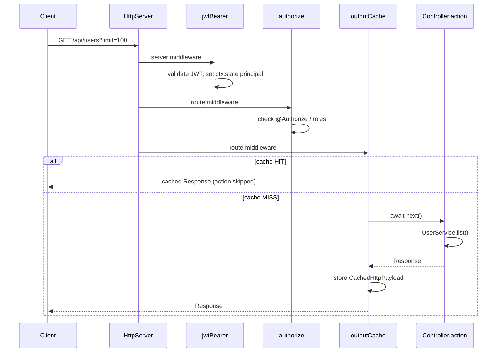
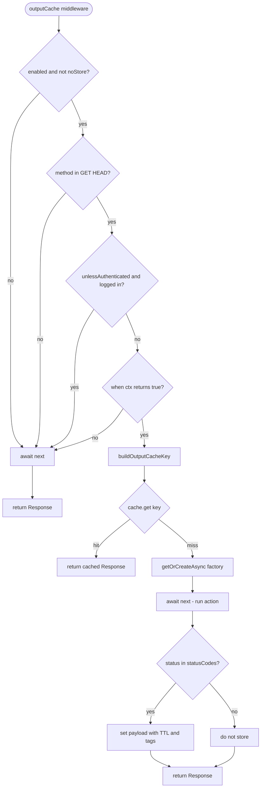
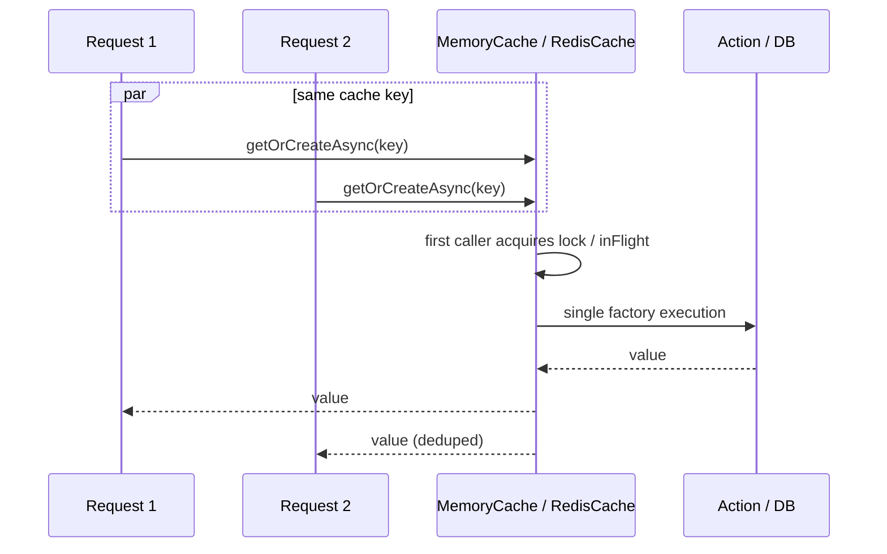
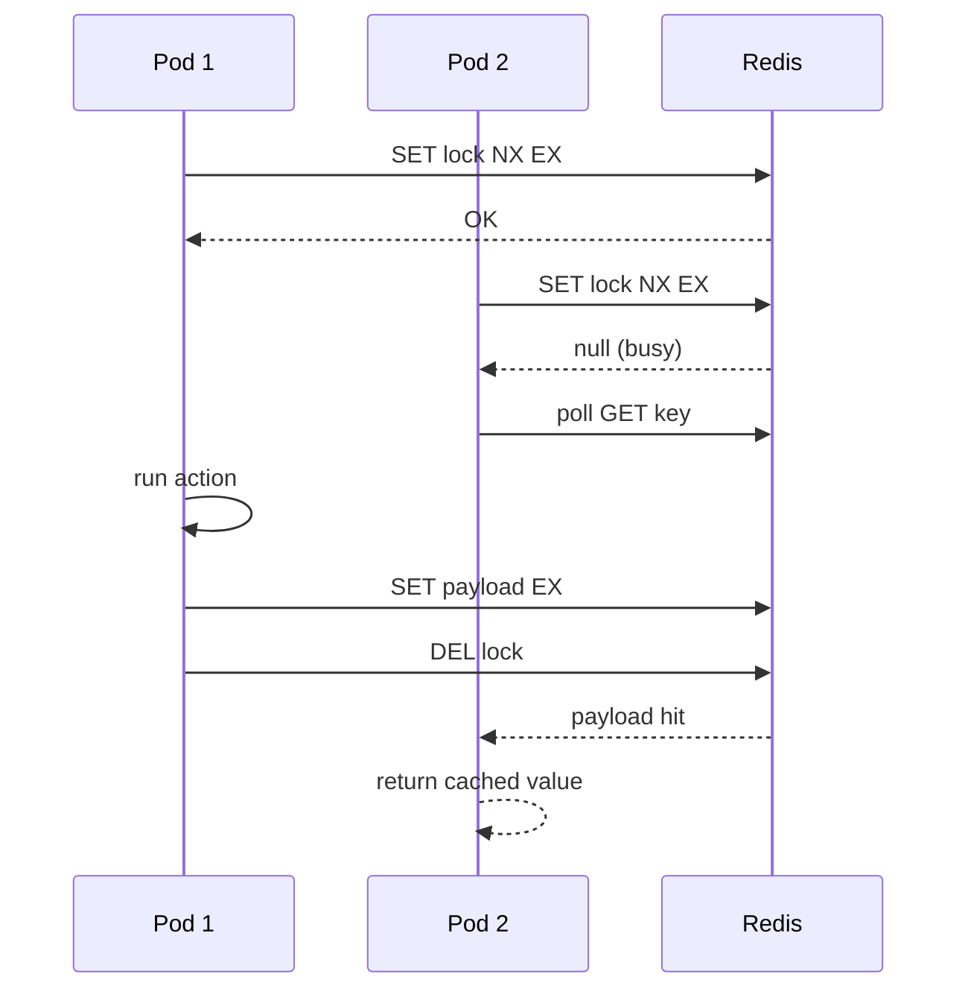

# Модуль Cache (`@/core/cache`) — спецификация

In-memory и распределённое (multi-instance) кэширование в стиле ASP.NET Core:
`[OutputCache]` + `IMemoryCache` / `IDistributedCache`. Четыре декоратора на двух уровнях
(HTTP и сервисы), без внешних npm-зависимостей, совместимо с `bun build --compile`.

**Backend-agnostic:** фреймворк (`@/core/cache`) знает только абстракцию `IDistributedCache`.
Конкретный backend (Redis и т.п.) живёт в `@/core/infra/*` и подключается через
`redisConnect(redisConfig, { cache: "distributed" })` в `@Infra`. В самом
`@/core/cache` нет ни одного `import … from "bun"`/Redis.

Быстрая навигация:
- [1. Что это и зачем](#1-что-это-и-зачем)
- [2. Архитектура: два уровня × два backend'а](#2-архитектура-два-уровня--два-backendа)
- [3. Быстрый старт](#3-быстрый-старт)
- [4. `memory()` / advanced cache module configuration](#4-memory--advanced-cache-module-configuration)
- [5. Named policies](#5-named-policies)
- [6. `@OutputCache` — HTTP output cache (memory)](#6-outputcache--http-output-cache-memory)
- [7. `@OutputRedisCache` — HTTP output cache (distributed)](#7-outputrediscache--http-output-cache-distributed)
- [8. `@Cacheable` — кэш методов сервисов (memory)](#8-cacheable--кэш-методов-сервисов-memory)
- [9. `@CacheableRedis` — кэш методов сервисов (distributed)](#9-cacheableredis--кэш-методов-сервисов-distributed)
- [10. DI-провайдеры: `cachedSingleton` / `cachedScoped` (+ auto-hook)](#10-di-провайдеры-cachedsingleton--cachedscoped--auto-hook)
- [11. `ICache` — программный API](#11-icache--программный-api)
- [12. Формирование ключей output cache](#12-формирование-ключей-output-cache)
- [13. Anti-stampede и concurrent miss](#13-anti-stampede-и-concurrent-miss)
- [14. Tag invalidation](#14-tag-invalidation)
- [15. Интеграция с HTTP pipeline](#15-интеграция-с-http-pipeline)
  - [15.1. Диаграммы pipeline (Mermaid)](#151-диаграммы-pipeline-mermaid)
- [16. Распределённый backend и `@/core/infra`](#16-распределённый-backend-и-coreinfra)
- [17. Безопасность](#17-безопасность)
- [18. Сценарии production](#18-сценарии-production)
- [19. Ограничения и анти-паттерны](#19-ограничения-и-анти-паттерны)
- [20. FAQ](#20-faq)
- [21. Карта папки](#21-карта-папки)

---

## 1. Что это и зачем

Модуль решает две разные задачи кэширования:

| Задача | Декоратор | Что кэшируется | Аналог .NET |
| --- | --- | --- | --- |
| **Output cache** | `@OutputCache` / `@OutputRedisCache` | готовый HTTP-ответ (status + headers + body) | `[OutputCache]` |
| **Method cache** | `@Cacheable` / `@CacheableRedis` | return value метода сервиса | `IMemoryCache` + `@Cacheable` |

**Зачем два уровня:**

- **HTTP (output cache)** — один раз отработал controller action → повторные GET/HEAD отдаются без выполнения action и часто без обращения к сервисам/БД. Подходит для публичных catalog/list endpoint'ов.
- **Сервис (method cache)** — кэшируется результат бизнес-метода независимо от HTTP. Подходит когда один сервис вызывается из нескольких controller'ов, фоновых job'ов или `@CacheableRedis` нужен между pod'ами.

**Зачем memory и Redis:**

| Backend | Область | Когда |
| --- | --- | --- |
| **In-memory** (`MemoryCache`) | один процесс | dev, single-instance, `@Cacheable` по умолчанию |
| **Distributed** (`IDistributedCache`, backend из `@/core/infra/*`) | все инстансы приложения | horizontal scaling, `@OutputRedisCache`, `@CacheableRedis` |

> «Redis» в именах декораторов = «распределённый уровень». Backend подключается отдельно;
> ядро оперирует абстракцией `IDistributedCache`.

Импорт публичного API:

```ts
import {
  memory,
  OutputCache,
  OutputRedisCache,
  Cacheable,
  CacheableRedis,
  cachedScoped,
  ICache,
} from "@/core/cache";
import { composeRouteMiddlewareComposers } from "@/core/http";
import { redisConnect } from "@/core/infra";
```

---

## 2. Архитектура: два уровня × два backend'а

```
┌─────────────────────────────────────────────────────────────────┐
│                         HTTP Request                            │
└───────────────────────────────┬─────────────────────────────────┘
                                │
          jwtBearer (auth) → authorize (@Authorize) → output cache
                                │
              ┌─────────────────┴─────────────────┐
              │                                   │
     @OutputCache (memory)         @OutputRedisCache (distributed)
              │                                   │
              ▼                                   ▼
         ICache<CachedHttpPayload>      DISTRIBUTED_OUTPUT_CACHE (registry)
              │                                   │
              └─────────────────┬─────────────────┘
                                │ cache HIT → response без action
                                │ cache MISS → action → store payload
                                ▼
                         Controller action
                                │
                                ▼
                    Service (DI proxy)
              ┌─────────────────┴─────────────────┐
              │                                   │
         @Cacheable (memory)        @CacheableRedis (distributed)
              │                                   │
              ▼                                   ▼
            ICache                  DISTRIBUTED_SERVICE_CACHE (registry)
         (method return value)           ({prefix}svc:… keys)
```

### Четыре декоратора — сводная таблица

| Декоратор | Уровень | Store | DI / HTTP wiring |
| --- | --- | --- | --- |
| `@OutputCache` | controller action | `ICache` in-memory | `cache.httpIntegration.routeMiddlewareComposer` |
| `@OutputRedisCache` | controller action | `IDistributedCache` | то же + `redisConnect(config, { cache: "distributed" })` в Infra |
| `@Cacheable` | метод сервиса | `ICache` in-memory | `cachedSingleton` / `cachedScoped` (или auto-hook) |
| `@CacheableRedis` | метод сервиса | `IDistributedCache` | `cachedSingleton` / `cachedScoped` + `redisConnect(config, { cache: "distributed" })` в Infra |

**Важно:** декораторы на **классе реализации**, не на TypeScript interface. DI регистрирует interface token → proxy оборачивает implementation.

### 2.1. Обзорная диаграмма (Mermaid)

```mermaid
flowchart TB
  subgraph HTTP["HTTP layer"]
    REQ[Request] --> JWT[jwtBearer]
    JWT --> AUTH[authorize @Authorize]
    AUTH --> OC{output cache decorator?}
    OC -->|@OutputCache| MEM_OUT[(ICache memory)]
    OC -->|@OutputRedisCache| REDIS_OUT[(IDistributedCache)]
    OC -->|none| ACT[Controller action]
    MEM_OUT -->|HIT| RESP[Response]
    REDIS_OUT -->|HIT| RESP
    MEM_OUT -->|MISS| ACT
    REDIS_OUT -->|MISS| ACT
    ACT --> RESP
  end

  subgraph SVC["Service layer"]
    ACT --> SVC_CALL[Service method call]
    SVC_CALL --> CB{method decorator?}
    CB -->|@Cacheable| MEM_SVC[(ICache memory)]
    CB -->|@CacheableRedis| REDIS_SVC[(IDistributedCache svc:)]
    CB -->|none| IMPL[UserService impl]
    MEM_SVC -->|HIT| RET[return value]
    REDIS_SVC -->|HIT| RET
    MEM_SVC -->|MISS| IMPL
    REDIS_SVC -->|MISS| IMPL
    IMPL --> RET
  end
```

---

## 3. Быстрый старт

### 3.1. Минимум: in-memory output + method cache

```ts
import { Cacheable, OutputCache, cachedScoped, memory } from "@/core/cache";
import { runApp } from "@/core/app";

await runApp(AppModule, {
  cache: memory(),
  http: { prefix: "api" },
});
```

Controller:

```ts
@Controller("products")
export class ProductsController {
  @Get("items")
  @OutputCache({ policy: "catalog" })
  list(limit = 20, page = 1) {
    return this.service.list(limit, page);
  }
}
```

Service:

```ts
class UserService implements IUserStore {
  @Cacheable({ policy: "userById", key: (...args) => String(args[0]) })
  async byId(id: number) {
    return this.users.find(id);
  }
}

// UsersModule:
providers: [
  cachedScoped(IUserStore, UserService, [repositoryFor(User)]),
],
```

### 3.2. С распределённым backend (multi-instance)

Backend подключается из `@/core/infra/*` — фреймворк остаётся backend-agnostic:

```ts
import { memory } from "@/core/cache";
import { Infra, redisConnect } from "@/core/infra";
import { runApp } from "@/core/app";
import { redisConfig } from "@/app/config/redis.config";
import { AppModule } from "@/app/modules/App.module";

@Infra({
  cache: redisConnect(redisConfig, { cache: "distributed" }),
})
class AppInfra {}

await runApp(AppModule, { cache: memory(), infra: AppInfra, http: {} });
```

```ts
@Get("items")
@OutputRedisCache({ policy: "catalog" })
list() { /* … */ }
```

```ts
class ProductService {
  @CacheableRedis({ seconds: 120, key: (...args) => String(args[0]), tags: ["products"] })
  async bySku(sku: string) { /* … */ }
}

// Тот же провайдер, что и для memory — распределённый уровень включается
// автоматически, когда Infra публикует реестр распределённых хранилищ в DI.
cachedScoped(IProductService, ProductService, deps);
```

---

## 4. `memory()` / advanced cache module configuration

```ts
const module = memory({
  maxEntries?: number,
  maxInFlight?: number,
  defaultTtlSeconds?: number,
  maxKeyLength?: number,
  maxValueBytes?: number,
});

// Advanced internal builder used by hosting/infra integration:
const advanced = buildCacheModule({
  policies?: CachePolicyRegistry,
  outputCache?: CacheOutputCacheOptions,
  token?: typeof ICache,       // default ICache
  imports?: OsnvModule[],
  healthCheck?: boolean,        // default true
});
```

### 4.1. `CacheOptions` — in-memory store

| Поле | Тип | Default | Описание |
| --- | --- | --- | --- |
| `maxEntries` | `number` | ∞ | Макс. записей; при переполнении — LRU eviction |
| `maxInFlight` | `number` | `1024` | Положительное safe integer. Предел выполняемых factory; новый miss при заполнении бросает `CacheCapacityError` до запуска factory |
| `defaultTtlSeconds` | `number` | — | TTL по умолчанию для `ICache.set` без явного `ttlSeconds` |
| `maxKeyLength` | `number` | `256` | Макс. длина ключа; более длинный ключ отклоняется |
| `maxValueBytes` | `number` | ∞ | Лимит размера значения (UTF-8 байты); `set` бросает при превышении |

### 4.2. `CacheOutputCacheOptions`

| Поле | Тип | Default | Описание |
| --- | --- | --- | --- |
| `enabled` | `boolean` | `true` | Глобальный выключатель HTTP output cache |
| `insecureAuthorizedRouteBehavior` | `"throw" \| "warn" \| "ignore"` | `"throw"` | Политика для `@Authorize` route без изоляции по пользователю |
| `requireAuthenticationByDefault` | `boolean` | `false` | Согласовать с `jwtModule({ options: { requireAuthenticationByDefault } })` при guard |

### 4.3. Распределённые хранилища

Подключение: `redisConnect(redisConfig, { cache: "distributed" })` в `@Infra`.
Коннектор публикует `DistributedCacheStores` и HTTP/service-реестры через DI.
Cache module принимает политики и настройки memory/output cache; ресурсами
внешнего backend управляет Infra. Параметры Redis — в §16.

### 4.4. Что регистрирует модуль

| Token / сервис | Назначение |
| --- | --- |
| `ICache` | `MemoryCache` singleton |
| `CACHE_OPTIONS` | validated options |
| `CACHE_POLICIES` | named policies из config |
| `HEALTH_CHECK` | `cache:memory` |

Infra отдельно публикует `DISTRIBUTED_CACHE_BACKEND`, `DISTRIBUTED_OUTPUT_CACHE`,
`DISTRIBUTED_SERVICE_CACHE`, свой lifecycle и health соединения.

---

## 5. Named policies

Policies — переиспользуемые пресеты в `cacheModule({ policies })`. Декоратор ссылается через `policy: "name"`.
Inline-поля декоратора **перекрывают** policy (policy → inline, inline wins).

```ts
cacheModule({
  policies: {
    catalog: {
      seconds: 60,
      varyByQuery: ["limit", "page"],
      tags: ["catalog"],
      clientCache: { public: true, maxAge: 30 },
    },
    userById: {
      seconds: 300,
      tags: ["users"],
      key: (...args) => `user:${String(args[0])}`, // для @Cacheable
    },
  },
});
```

```ts
@OutputCache({ policy: "catalog" })
@Cacheable({ policy: "userById" })
```

Policy тип `CachePolicy` объединяет поля output cache и method cache — одна policy может использоваться и там, и там (лишние поля игнорируются на другом уровне).

---

## 6. `@OutputCache` — HTTP output cache (memory)

Кэширует **полный HTTP-ответ** после выполнения action. На cache hit controller **не вызывается**.

### 6.1. Справочник полей

#### Общие (`CachePolicyBase`)

| Поле | Тип | Default | Описание |
| --- | --- | --- | --- |
| `seconds` | `number` | — | **Обязателен** (inline или в policy). TTL записи |
| `policy` | `string` | — | Имя policy из `cacheModule({ policies })` |
| `tags` | `string[]` | — | Теги для `ICache.evictByTag(tag)` |
| `enabled` | `boolean` | `true` | `false` — middleware не вешается (metadata сохраняется) |
| `noStore` | `boolean` | `false` | `true` — не читать и не писать кэш |

#### HTTP-specific (`OutputCachePolicyFields`)

| Поле | Тип | Default | Описание |
| --- | --- | --- | --- |
| `varyByQuery` | `string[]` \| `"*"` | `"*"` | Query-параметры в ключе. `[]` — явно игнорировать query |
| `varyByRoute` | `string[]` | — | Route params (`:id`, …) в ключе |
| `varyByHeader` | `string[]` | — | Значения заголовков запроса в ключе |
| `varyByUser` | `boolean` | `false` | Отдельный ключ на JWT `sub` (требует auth middleware до cache) |
| `varyByClaim` | `string` | — | Отдельный ключ на значение claim (например role) |
| `maxBodyBytes` | `number` | `16777216` | Макс. body, материализуемый для одной записи; `0` явно отключает лимит |
| `bodyReadTimeoutMs` | `number` | `5000` | Общий timeout материализации body; `0` явно отключает timeout |
| `unlessAuthenticated` | `boolean` | `false` | `true` — не кэшировать для logged-in пользователей |
| `allowAuthenticatedShared` | `boolean` | `false` | Явно разрешить общую запись для optional-auth request, если ответ не зависит от principal |
| `methods` | `string[]` | `GET`, `HEAD` | HTTP-методы, для которых работает cache |
| `statusCodes` | `number[]` | `[200]` | Какие status codes сохранять |
| `clientCache` | `ClientCacheOptions` | — | `Cache-Control` для браузера/CDN (Response Cache слой) |
| `when` | `(ctx) => boolean \| Promise<boolean>` | — | `false` → skip read/write |

Если body превышает `maxBodyBytes` или не успевает материализоваться за
`bodyReadTimeoutMs`, ответ отдаётся клиенту без изменений, но в cache не попадает.

#### `ClientCacheOptions`

| Поле | Тип | Описание |
| --- | --- | --- |
| `maxAge` | `number` | `max-age=N` в `Cache-Control` |
| `public` | `boolean` | `public` directive |
| `private` | `boolean` | `private` directive |
| `noCache` | `boolean` | `no-cache` directive |

Для `varyByUser`/`varyByClaim` client policy всегда становится `private`;
`clientCache.public: true` совместно с персонализацией — startup error.

### 6.2. Примеры

**Публичный catalog с pagination:**

```ts
@Get("items")
@OutputCache({
  seconds: 120,
  varyByQuery: ["limit", "page"],
  tags: ["catalog"],
  clientCache: { public: true, maxAge: 60 },
})
list(limit = 20, page = 1) {
  return this.repo.list(limit, page);
}
```

**Protected list — изоляция по пользователю:**

```ts
@Controller("users")
@Authorize()
export class UsersController {
  @Get()
  @OutputCache({ policy: "users" })
  // policy: { seconds: 30, varyByQuery: ["limit"], varyByUser: true, tags: ["users"] }
  list(limit = 100) { /* … */ }
}
```

**Условное кэширование:**

```ts
@Get("report")
@OutputCache({
  seconds: 300,
  when: (ctx) => ctx.url.searchParams.get("preview") !== "1",
})
report() { /* … */ }
```

**Только для anonymous:**

```ts
@Get("landing-stats")
@OutputCache({ seconds: 60, unlessAuthenticated: true })
stats() { /* один кэш для всех гостей; logged-in всегда fresh */ }
```

### 6.3. Что сохраняется в кэше

Ответ сериализуется как `CachedHttpPayload`:

```ts
{ status: number; headers: Record<string, string>; body: Uint8Array }
```

Sensitive response headers **не сохраняются и не replay'ятся**:
`Set-Cookie`, `Authorization`, `Cookie`, `WWW-Authenticate`, `Proxy-Authenticate`, `Proxy-Authorization`.

Body читается целиком (`arrayBuffer`) — **streaming response не поддерживается**.

---

## 7. `@OutputRedisCache` — HTTP output cache (distributed)

Семантика идентична `@OutputCache`, store — распределённый `IDistributedCache`.
Shared между всеми инстансами приложения с одним backend.

### 7.1. Дополнительные поля

| Поле | Тип | Default | Описание |
| --- | --- | --- | --- |
| `connection` | `string` | `"default"` | Имя connection backend'а |
| `keyPrefix` | `string` | из connection | Доп. prefix для ключей **этого route** |
| `lockSeconds` | `number` | из connection | Override TTL anti-stampede lock при miss |

Наследует все поля `@OutputCache` (см. §6.1).

### 7.2. Подключение

```ts
import { Infra, redisConnect } from "@/core/infra";
import { redisConfig } from "@/app/config/redis.config";

@Infra({
  cache: redisConnect(redisConfig, { cache: "distributed" }),
})
class AppInfra {}
```

```ts
@Get("feed")
@OutputRedisCache({ seconds: 30, connection: "analytics", varyByQuery: ["cursor"] })
feed() { /* … */ }
```

### 7.3. Pipeline (Redis)

```
MISS:
  GET key → miss
  SET lock:{key} NX EX lockSeconds
  → run action (один pod)
  → SET payload EX seconds
  → SADD tag:{tag} payloadKey

HIT:
  GET key → deserialize CachedHttpPayload → Response
```

Concurrent miss:
- **на одном pod** — in-process `inFlight` dedup;
- **между pod'ами** — `SET NX EX` + poll peer result до `lockSeconds`.

### 7.4. Ограничения

- Без DI-реестра `DISTRIBUTED_OUTPUT_CACHE` на route с `@OutputRedisCache` первый запрос получает `CacheError`.
- `@OutputCache` + `@OutputRedisCache` на одном action — **warning**, побеждает распределённый.
- Требует готовое соединение до первого запроса: Redis подключает `InfraLifecycle`, default phase −100.

---

## 8. `@Cacheable` — кэш методов сервисов (memory)

Перехватывает вызов метода через DI proxy. Кэшируется **return value** (ссылка на объект).

### 8.1. Справочник полей

| Поле | Тип | Default | Описание |
| --- | --- | --- | --- |
| `seconds` | `number` | — | **Обязателен** (inline или policy) |
| `policy` | `string` | — | Named policy |
| `tags` | `string[]` | — | Tag invalidation |
| `enabled` / `noStore` | `boolean` | — | Как у output cache |
| `key` | `string` \| `(...args) => string` | auto | Ключ записи. Без `key` — SHA-256 от class/method и канонического графа аргументов; неподдерживаемый ввод обходит кэш |
| `unless` | `(...args) => boolean` | — | `true` → skip cache для этого вызова |

### 8.2. Примеры

Автоматический ключ поддерживает примитивы, обычные массивы, стандартный Date,
Map/Set без дополнительных свойств и записи с Object.prototype/null и
перечисляемыми строковыми data-полями. Map/Set обходятся встроенными итераторами
в порядке вставки; вложенные коллекции поддерживаются. Поля записей по-прежнему
сортируются. Граф всего списка аргументов различает повторную ссылку и равные
копии. Объектным ключам Map и элементам Set присваивается стабильная identity
внутри сервисного proxy, включая их появления в других аргументах. UUID encoder
различает такие identity даже у разных proxy с общим cacheNamespace. Поэтому
проверка `map.has(knownObject)` не смешивается с поиском другого равного объекта.
Содержимое графа пересчитывается при каждом вызове; мутации влияют на следующий ключ.

Для классов со скрытым состоянием, подклассов встроенных типов, accessors,
functions/symbols, symbol/non-enumerable полей, дополнительных свойств встроенных
объектов, циклов, Proxy и invalid Date обёртка автоматически вызывает исходный
метод без кэша. Метод вызывается один раз, оба backend и distributed registry
не затрагиваются; getters/Proxy traps не исполняются encoder. Это не требует
явного `key`. Ошибки метода, явно заданного `key` и backend не подавляются.
Для CacheableRedis отсутствие backend проверяется после решения использовать кэш.

Обычные записи/массивы остаются данными по значению: порядок полей записи,
флаги дескрипторов и произвольная внешняя идентичность вложенных объектов не входят
в ключ. Аргументы не замораживаются: ключ — снимок на входе, поэтому данные
незавершённой операции не следует менять. При иной семантике эквивалентности
можно задать прикладной `key`. Getter/setter самого кэшируемого сервиса исполняются
на исходном экземпляре и поддерживают нативные private-поля.

```ts
class UserService implements IUserStore {
  @Cacheable({
    seconds: 300,
    key: (...args: readonly unknown[]) => `user:${String(args[0])}`,
    tags: ["users"],
  })
  async byId(id: number) {
    return this.users.find(id);
  }

  @Cacheable({
    policy: "userById",
    unless: (id: unknown) => Number(id) < 0,
  })
  async byIdWithPolicy(id: number) { /* … */ }
}
```

**Ключ `key` — всегда через `(...args: readonly unknown[]) => string`** (TypeScript constraint proxy).

### 8.3. Class-level vs method-level

```ts
@Cacheable({ seconds: 60, tags: ["reports"] })
class ReportService {
  daily() { /* cached — inherits class metadata */ }
  live() { /* cached — unless overridden */ }

  @Cacheable({ seconds: 5 })
  live() { /* method metadata overrides class for this method */ }
}
```

---

## 9. `@CacheableRedis` — кэш методов сервисов (distributed)

Shared method cache между инстансами. Значения сериализуются **JSON** (`jsonCacheCodec`).

### 9.1. Поля

Все поля `@Cacheable` (§8.1) плюс:

| Поле | Тип | Default | Описание |
| --- | --- | --- | --- |
| `connection` | `string` | `"default"` | Distributed connection name |
| `lockSeconds` | `number` | из connection | Distributed lock TTL |

### 9.2. Namespace ключей

| Store | Key pattern |
| --- | --- |
| HTTP output (codec payload) | `{keyPrefix}{routeKey}` |
| Service (codec JSON) | `{keyPrefix}svc:{methodKey}` |

HTTP и service cache **не пересекаются** даже при одном connection.

### 9.3. Пример hybrid-класса

```ts
class UserService implements IUserStore {
  @Cacheable({ policy: "userById", key: (...args) => String(args[0]) })
  async byId(id: number) { /* memory — быстрый локальный */ }

  @CacheableRedis({ policy: "userByName", key: (...args) => String(args[0]) })
  async findByName(name: string) { /* Redis — shared lookup для auth */ }
}
```

**Один метод — один декоратор.** `@Cacheable` + `@CacheableRedis` на одном method → runtime error.

---

## 10. DI-провайдеры: `cachedSingleton` / `cachedScoped` (+ auto-hook)

Один провайдер покрывает оба уровня. `@Cacheable` → in-memory `ICache`; `@CacheableRedis` →
распределённый `DISTRIBUTED_SERVICE_CACHE` — **автоматически**, если реестр зарегистрирован
через Infra/DI. Отдельных `redisCached*` / `hybridCached*` больше нет.

| Provider | Декораторы | Зависимости DI | Scope |
| --- | --- | --- | --- |
| `cachedSingleton` | `@Cacheable` и/или `@CacheableRedis` | `ICache`, `CACHE_POLICIES`, (опц.) `DISTRIBUTED_SERVICE_CACHE` | singleton |
| `cachedScoped` | `@Cacheable` и/или `@CacheableRedis` | то же | scoped |

Removed aliases: `src/osnv/core/cache/COMPATIBILITY.md`.

```ts
// Interface token ← proxy ← implementation class with decorators.
// Работает и для @Cacheable, и для @CacheableRedis (если backend настроен).
cachedScoped(IUserStore, UserService, [repositoryFor(User)]);
```

### 10.0. Магия из коробки (auto-hook)

`memory()` регистрирует hook на core-провайдеры `singleton()` / `scoped()`: если класс
несёт `@Cacheable` / `@CacheableRedis`, обычная регистрация **автоматически** оборачивается
кэширующим proxy. Явный `cachedScoped` нужен лишь когда вы хотите быть предельно явными.

### 10.1. Interface vs implementation — частый вопрос

```ts
interface IUserStore {
  byId(id: number): Promise<User | undefined>;
}

class UserService implements IUserStore {
  @Cacheable({ seconds: 60, key: (...args) => String(args[0]) })
  async byId(id: number) { /* … */ }
}

// ✅ правильно
cachedScoped(IUserStore, UserService, deps);

// ❌ декоратор на interface не работает
// При подключённом memory() обычный singleton(IUserStore, UserService)
// также получает proxy через auto-hook.
```

### 10.2. Encapsulation модулей

Приложение должно установить cache module один раз через `runApp({ cache: memory() })`
или корневый import `memory()`. Feature-модуль регистрирует только свой сервис:

```ts
@Module({
  imports: [UsersDataModule],
  providers: [cachedScoped(IUserStore, UserService, deps)],
})
class UsersModule {}
```

---

## 11. `ICache` — программный API

Прямое использование без декораторов (invalidation, custom cache logic):

```ts
@Inject(ICache) private readonly cache: ICache;

// sync/async factory с dedup
const value = await this.cache.getOrCreateAsync(
  "config:features",
  () => this.loadFeatures(),
  { ttlSeconds: 300, tags: ["config"] },
);

// групповая очистка
this.cache.evictByTag("users");
```

| Метод | Описание |
| --- | --- |
| `get(key)` | Читает запись; `undefined` если нет или TTL истёк |
| `set(key, value, options?)` | Записывает; **бросает** при нарушении лимитов |
| `getOrCreate(key, factory, options?)` | Sync/async factory; dedup если factory вернула Promise |
| `getOrCreateAsync(key, factory, options?)` | Async + in-process anti-stampede |
| `remove(key)` | Удаляет одну запись |
| `clear()` | Очищает весь store |
| `evictByTag(tag)` | Удаляет все записи с тегом |
| `list()` / `size` | Introspection (без expired) |

`getOrCreate*` не бросает при переполнении — graceful degradation (значение возвращается, но может не сохраниться).

Прямые ключи `ICache` длиннее `maxKeyLength` (default 256) отклоняются.
Встроенные HTTP/service key builders до записи хэшируют каноническое представление SHA-256.

---

## 12. Формирование ключей output cache

Функция `buildOutputCacheKey(ctx, routeName, options)` собирает JSON-tuple,
куда всегда входят HTTP method, action identity, request `origin` и фактический `pathname`,
а затем возвращает `http:<sha256>`. Исходные query/header/user values в keyspace не попадают.

```
http:<sha256(JSON tuple)>
```

| Vary option | Компонент tuple | Пример |
| --- | --- | --- |
| `varyByQuery: ["limit"]` | `["query","limit",["20"]]` | все repeated values указанного params |
| `varyByQuery: "*"` | все query names sorted | каждое имя + все его values |
| `varyByRoute: ["id"]` | `["route","id","42"]` | |
| `varyByHeader: ["Accept-Language"]` | `["header","accept-language","ru"]` | header name lowercased |
| `varyByUser: true` | auth state + `sub` | пустой authenticated `sub` отключает cache для request |
| `varyByClaim: "role"` | auth state + claim type/value | пустой claim отключает cache для request |
| API version | `["version","2"]` | если `ctx.apiVersion` задан |

Пример итогового ключа:

```
http:8f5d…<64 hex chars>
```

---

## 13. Anti-stampede и concurrent miss

**Проблема:** 100 одновременных miss на один ключ → 100 одинаковых запросов к БД.

**Решение:**

| Store | Механизм |
| --- | --- |
| Memory (`MemoryCache`, output + `@Cacheable`) | `inFlight` Map — один factory на ключ в процессе |
| Redis output / `@CacheableRedis` | `SET lock NX EX` + in-process dedup + poll peer |

При Redis lock не acquired — ожидание результата peer pod'а (poll каждые 50ms до `lockSeconds`).

---

## 14. Tag invalidation

```ts
@OutputCache({ seconds: 300, tags: ["catalog", "products"] })
@Cacheable({ seconds: 300, tags: ["users"] })
```

```ts
import { DISTRIBUTED_OUTPUT_CACHE, DISTRIBUTED_SERVICE_CACHE } from "@/core/cache";

// После мутации данных:
cache.evictByTag("catalog");   // memory output + method cache

// Распределённый уровень (резолв реестра из DI):
await services.resolve(DISTRIBUTED_OUTPUT_CACHE).resolve("default").evictByTag("catalog");
await services.resolve(DISTRIBUTED_SERVICE_CACHE).resolve("default").evictByTag("users");
```

Backend хранит tag index как SET: `SADD tag:{tag} memberKeys` (+ `EXPIRE` на размер TTL записи)
→ `SMEMBERS` + `DEL` при evict. У SET теперь есть TTL — индекс тегов не растёт безгранично.

**Особенность:** invalidation **не автоматическая** — приложение вызывает `evictByTag` после POST/PUT/DELETE (как в ASP.NET `IOutputCacheStore.EvictByTagAsync`).

---

## 15. Интеграция с HTTP pipeline

Порядок middleware (типичный production setup):

```
1. jwtBearer()              ← server middleware (authentication)
2. authorize()              ← route composer (authorization, @Authorize)
3. outputCache()            ← route composer (cache module)
4. controller action
```

Подключение:

```ts
httpModule({
  middleware: [...jwt.httpIntegration.serverMiddleware],
  routeMiddlewareComposer: composeRouteMiddlewareComposers(
    jwt.httpIntegration.routeMiddlewareComposer,
    cache.httpIntegration.routeMiddlewareComposer,
  ),
});
```

**Auth до cache обязателен** для `varyByUser` / `varyByClaim` — principal должен быть в `ctx.state` до построения ключа.

На **cache hit** шаг 4 не выполняется — в логах HTTP middleware ответ быстрее, action side effects отсутствуют.

### 15.1. Диаграммы pipeline (Mermaid)

#### Порядок middleware



#### Output cache — decision flow



#### Concurrent miss (anti-stampede)



#### Redis distributed lock (между pod'ами)



#### `@Cacheable` proxy (service layer)

```mermaid
flowchart LR
  CTRL[Controller] -->|resolve IUserStore| PROXY[Cacheable Proxy]
  PROXY --> META{@Cacheable on method?}
  META -->|no| BIND[bind original method]
  META -->|yes| KEY[build key from args]
  KEY --> G{ICache.get}
  G -->|hit| RET1[return cached value]
  G -->|miss| CALL[call UserService method]
  CALL --> SET[ICache.set with TTL]
  SET --> RET2[return fresh value]
```

---

## 16. Распределённый backend и `@/core/infra`

### Ответственность и контракты

`DistributedCache` владеет TTL, тегами, fencing lock, объединением запросов и
ограничениями значений. Низкоуровневые команды реализует `DistributedCacheDriver`;
для Redis это `RedisDistributedCacheDriver` из Infra.
`DistributedCacheStores` предоставляет имена, HTTP/service-реестры и `ping()` без
управления соединением. `RedisDistributedCacheBackend` строит эти реестры поверх
клиента, которым владеет `redisConnect` и его `InfraLifecycle`.

Контракт и DI-токен `DISTRIBUTED_CACHE_BACKEND` используют `DistributedCacheStores`.
Он доступен через публичный Cache API и не содержит методов lifecycle.
Redis backend также не имеет `start/stop`: подключение и health принадлежат
Redis-коннектору. Cache не регистрирует backend как HostedService.

### Единственный backend

В приложении допускается одна unkeyed-регистрация `DISTRIBUTED_CACHE_BACKEND`.
При сборке модульного контейнера Cache проверяет итоговые регистрации после
configure. Два backend, даже с разными `connection` или в разных модулях,
дают `CacheError` до создания клиентов; порядок imports не выбирает победителя.
Общие HTTP/service-реестры относятся к одному выбранному backend.
Повторный импорт того же модуля обрабатывается DI однократно; отдельные контейнеры
не конфликтуют. Явная замена через `configure.replace` учитывается по результату.
Проверка работает в `createContainer`/kernel, не в standalone ServiceCollection.

Один `redisConnect(config, { cache: ... })` предоставляет одно именованное
соединение. Другие Redis-клиенты разрешены с отдельными `token` без cache mode.
Свой backend может предоставлять несколько имён через NamedCacheRegistry;
автоматического объединения нескольких backend и поля `connections` в
`redisConnect` нет.

### Параметры Redis

Объявление `config` содержит обязательный `url: string | Secret`. Второй аргумент
коннектора принимает `token?` и `cache?: "distributed" | { mode: "distributed", ...tuning }`.
Без cache mode регистрируется только клиент. Tuning необязателен:

| Поле | Тип | Default | Описание |
| --- | --- | --- | --- |
| `connection` | `string` | `default` | Имя для decorators и NamedCacheRegistry |
| `keyPrefix` | `string` | `osnv:cache:` | Общий префикс; backend добавляет `out:` и `svc:` |
| `defaultLockSeconds` | `number` | `10` | Положительное конечное время блокировки, секунды |
| `maxKeyLength` | `number` | `512` | Положительное целое, длина ключа |
| `maxValueBytes` | `number` | Без лимита | Положительное целое; предел сериализованного значения |
| `pollIntervalMs` | `number` | `50` | Положительный конечный интервал ожидания результата, мс |

Коннектор читает представление `defineConfig` своего kernel. Env-переопределения
задаются правилами kernel/config и объявлением приложения; универсальные
`REDIS_URL`/`REDIS_KEY_PREFIX` автоматически не читаются.

### Запуск и остановка

`InfraLifecycle` лениво создаёт клиента и публикует его через DI. Backend и
реестры могут быть разрешены до старта; I/O разрешено выполнять после готовности
соединения. При старте Infra вызывает `RedisClient.connect()` (default phase −100),
при ошибке или остановке — `close()` ровно один раз. Backend не открывает и не
закрывает клиент. Повторное использование остановленного kernel не поддерживается.

### Атомарность lock (fencing) и health

Lock берётся `SET lock token NX EX`. Снятие — атомарный Lua `compare-and-del`
(`if get==token then del`); медленный worker не удалит чужой lock.

`cache:memory` показывает entries. Infra-путь Redis регистрирует `infra:<имя>`
с реальным PING. Пользовательский коннектор определяет свою проверку соединения.
Без distributed backend доступны memory-операции; `@OutputRedisCache` и
`@CacheableRedis` требуют соответствующие DI-реестры.

Проверки композиции: [cache-composition.test.ts](../infra/test/cache-composition.test.ts).
Проверки алгоритмов с подставным драйвером не подменяют физическую приёмку Redis.

---

## 17. Безопасность

### 17.1. Startup guard

При HTTP startup модуль проверяет: `@OutputCache` / `@OutputRedisCache` на route с `@Authorize` (или global auth default) **без** `varyByUser: true` и **без** `unlessAuthenticated: true` → fail-fast error по умолчанию:

```
[cache] @OutputCache on UsersController.list is on an authorized route
without varyByUser or unlessAuthenticated — …
```

Для миграции можно временно включить warning-mode:
`buildCacheModule({ outputCache: { insecureAuthorizedRouteBehavior: "warn" } })`.
Полное отключение (`"ignore"`) допустимо только при внешней политике безопасности.

### 17.2. Рекомендации по сценариям

| Сценарий | Рекомендация |
| --- | --- |
| Публичный GET catalog | `@OutputCache({ seconds: 60, varyByQuery: [...] })` |
| Protected list per user | `varyByUser: true` |
| Shared stats только для guests | `unlessAuthenticated: true` |
| Персональные данные | `@Cacheable` в сервисе с явным `key`, не output cache |
| Multi-instance public API | `@OutputRedisCache` |
| Auth lookup shared между pods | `@CacheableRedis` на `findByName` / similar |

### 17.3. Что нельзя кэшировать через output cache

- Ответы с `Set-Cookie` (session establishment)
- Streaming / chunked responses
- Персональные данные без `varyByUser`
- Mutating methods (POST/PUT/DELETE) — по умолчанию не кэшируются (`methods: GET, HEAD`)

---

## 18. Сценарии production

Реальный composition root — `src/index.ts` + `src/app/infra/App.infra.ts`:

```ts
import { memory } from "@/core/cache";
import { Infra, redisConnect } from "@/core/infra";
import { redisConfig } from "@/app/config/redis.config";

@Infra({
  cache: redisConnect(redisConfig, { cache: "distributed" }),
})
class AppInfra {}

await runApp(AppModule, {
  infra: AppInfra,
  cache: memory(),
  http: { port: 3000, prefix: "api" },
});
```

**Service** (один и тот же провайдер для memory и distributed):

```ts
class UserService implements IUserStore {
  @Cacheable({ policy: "userById", key: (...args) => String(args[0]) })
  async byId(id: number) { /* … */ }

  @CacheableRedis({ policy: "userByName", key: (...args) => String(args[0]) })
  async findByName(name: string) { /* … */ }
}

// UsersModule:
imports: [UsersDataModule],
providers: [cachedScoped(IUserStore, UserService, deps)],
```

`@CacheableRedis.findByName` использует распределённый уровень автоматически, когда backend
настроен; без backend такой вызов бросит понятную ошибку (см. §19).

### Проверка output cache (manual)

1. `GET /api/users?limit=100` с JWT → список N пользователей
2. `POST /api/users` → создать нового
3. Повторный `GET /api/users?limit=100` → **всё ещё N** (stale до истечения TTL / evictByTag)

Скрипт: `bun run scripts/test-binary-live.ts` (нужен app-бинарник `./bin/osnv-app` на порту 3460).

---

## 19. Ограничения и анти-паттерны

### Ограничения v1

| # | Ограничение |
| --- | --- |
| 1 | `@OutputCache` / `@Cacheable` — один процесс (не shared) |
| 2 | `@CacheableRedis` values — JSON-serializable only (Date → string, class instances теряют prototype) |
| 3 | `@Cacheable` / `@CacheableRedis` без явного `key` кодируют поддержанные данные и Map/Set по §8.2; неподдерживаемые аргументы, включая cycles и скрытое состояние, автоматически обходят кэш |
| 4 | Кэшируются **ссылки** на objects in-memory — мутация после get меняет «кэш» |
| 5 | Output cache материализует полный body в пределах `maxBodyBytes`/`bodyReadTimeoutMs`; большие или долгие streams отдаются без cache |
| 6 | Tag invalidation — manual (`evictByTag`), не привязана к ORM events |
| 7 | Нет `@CacheEvict` decorator (invalidate в коде явно) |
| 8 | Redis-backend — только Bun built-in `RedisClient` (другой backend — свой `DistributedCacheDriver`) |

**Что улучшено в этой версии:**

- Distributed lock снимается атомарно (fencing-token Lua `compare-and-del`) — нет Redlock-бага.
- `maxValueBytes` применяется и к распределённому уровню, и к бинарным значениям (output payload).
- `MemoryCache.size` — O(1) (без полного скана при каждом обращении).
- InfraLifecycle освобождает клиент при ошибке подключения; координатор откатывает уже запущенные службы.
- Health-check `infra:<имя>` Redis-коннектора делает реальный `PING`.
- Один кэширующий proxy (`wrapCachedService`) на оба уровня — без дублирования и фейкового `ICache`.

### Анти-паттерны

```ts
// ❌ Декоратор на interface
interface IUserStore {
  @Cacheable({ seconds: 60 }) // не работает
  byId(id: number): Promise<User>;
}

// ✅ Обычный singleton/scoped — auto-hook оборачивает класс с @Cacheable/@CacheableRedis
singleton(IUserStore, UserService); // proxy применяется автоматически (cacheModule подключён)

// ❌ @OutputRedisCache без распределённых хранилищ в Infra/DI
memory({}); // + @OutputRedisCache → CacheError на первом запросе

// ❌ Оба output decorator на action
@OutputCache({ seconds: 60 })
@OutputRedisCache({ seconds: 60 }) // warning, wins distributed

// ❌ Оба method decorator на одном method
@Cacheable({ seconds: 10 })
@CacheableRedis({ seconds: 10 }) // runtime throw

// ❌ Output cache персональных данных без varyByUser
@Authorize()
@OutputCache({ seconds: 60 }) // startup throw + data leak risk
```

---

## 20. FAQ

### `@OutputCache` или `@Cacheable` — что выбрать?

| Критерий | `@OutputCache` | `@Cacheable` |
| --- | --- | --- |
| Кэширует | весь HTTP-ответ | return value метода |
| Уровень | controller | service |
| Vary по query/header/user | ✅ | ❌ (только `key` из args) |
| Client `Cache-Control` | ✅ `clientCache` | ❌ |
| Переиспользование вне HTTP | ❌ | ✅ (jobs, другие controllers) |
| Streaming response | ❌ | ✅ (метод может stream, но value cache — нет) |

**Правило:** публичный GET endpoint → `@OutputCache`. Метод вызывается из нескольких мест или нужен cache без HTTP → `@Cacheable`.

---

### `@OutputCache` или `@OutputRedisCache`?

| | Memory | Redis |
| --- | --- | --- |
| Инстансы | 1 процесс | N pod'ов |
| Зависимости | только `cacheModule()` | + `REDIS_URL` |
| Latency | ~μs | ~ms (network) |
| Eviction tags | in-process | shared в Redis |

Один pod / dev → `@OutputCache`. Production horizontal scale + одинаковые GET для всех → `@OutputRedisCache`.

Отдельные декораторы (не `provider: "redis"` в options) — явный store в metadata, проще grep и fail-fast без redis config.

---

### Поставил `@Cacheable` на сервис, но кэш не работает

Чеклист:

1. Декоратор на **class `UserService`**, не на `interface IUserStore`.
2. Root app устанавливает `cache: memory()` или imports `memory()` (auto-hook + `ICache`, `CACHE_POLICIES`).
3. Регистрация через `singleton`/`scoped` (auto-hook обернёт) или явно `cachedScoped`/`cachedSingleton`.
4. В options есть **`seconds`** (inline или в `policy`).
5. Для `@CacheableRedis` — в infra подключён `redisConnect(redisConfig, { cache: "distributed" })`, иначе вызов бросит ошибку.

---

### Controller inject'ит interface — cache на implementation работает?

**Да**, если:

```ts
// UserService.ts — декоратор здесь
@Cacheable({ seconds: 60 })
async byId(id: number) { ... }

// UsersModule.ts — регистрация на interface token
cachedScoped(IUserStore, UserService, deps);
```

Controller получает proxy, зарегистрированный как `IUserStore`. Metadata читается с класса `UserService` (`Symbol.metadata`), не с interface.

---

### Что такое `varyByQuery`?

Query-параметры участвуют в **ключе кэша**. Запросы с разными значениями — разные записи:

```
GET /items?limit=20  → http:<digest A>
GET /items?limit=50  → http:<digest B>  (отдельный cache entry)
```

`varyByQuery: "*"` — все query params (sorted) и это secure default.
Только явный `varyByQuery: []` игнорирует query для доказанно query-independent ответа.

---

### После POST данные в GET не обновились — это баг?

**Нет**, если не вызывали `evictByTag`. Output cache хранит snapshot ответа до истечения TTL.

```ts
await this.users.add(dto);
await this.cache.evictByTag("users"); // или ICache из DI после мутации
```

Demo-проверка: `scripts/test-binary-live.ts` — после POST ghost-user не виден в cached list.

---

### Есть заголовок `X-Cache: HIT`?

**Нет** в v1. Признаки hit:

- повторный запрос быстрее в HTTP logs;
- controller side effects не срабатывают (stale data test);
- `ICache.size` растёт после первого miss.

---

### Можно ли `@OutputCache` и `@OutputRedisCache` на одном action?

Технически можно, но **не нужно** — startup warning, побеждает Redis. Выберите один store.

---

### Можно ли `@Cacheable` и `@CacheableRedis` на одном методе?

**Нет** — runtime error. На **разных** методах одного класса — обычный `cachedScoped` (один proxy роутит memory и distributed).

---

### `cachedSingleton` или `cachedScoped`?

| | singleton | scoped |
| --- | --- | --- |
| Proxy instance | один на DI-регистрацию в контейнере | один на DI-регистрацию в scope |
| `@Cacheable` cache | общий ICache store, автоматические ключи изолированы по экземпляру | тот же ICache store, автоматические ключи изолированы по экземпляру |
| ORM `DbContext` | ⚠️ осторожно | ✅ типичный case |

В demo `UserService` + ORM → **`cachedScoped`**. Stateless read-only сервис без scoped deps → можно `cachedSingleton`.
Явный `key` у `cachedScoped` и `cachedSingleton` — договор на совместное использование:
включайте в него tenant/user, если результат персонализирован. Без явного `key`
framework изолирует автоматический ключ по экземпляру, чтобы скрытое состояние
конструктора не попало в ответ другой регистрации или запроса. Это относится и к
`@CacheableRedis`: для обмена между процессами и переиспользования после перезапуска
нужен явный прикладной `key`. DI создаёт объект обычным class provider, а затем
применяет proxy; constructor deps и lifecycle не обходятся.

---

### Нужен ли Redis для работы приложения?

**Нет.** Без backend работают `@OutputCache` + `@Cacheable` (memory). `@OutputRedisCache`
бросает CacheError на первом запросе, а `@CacheableRedis` — при вызове метода, если
распределённые хранилища не зарегистрированы через Infra/DI. Обычное подключение:
`redisConnect(config, { cache: "distributed" })` в `infraModule`.

---

### Как инвалидировать cache после update?

```ts
import { ICache, DISTRIBUTED_OUTPUT_CACHE, DISTRIBUTED_SERVICE_CACHE } from "@/core/cache";

// memory output + @Cacheable
cache.evictByTag("users");

// distributed HTTP output / service cache (резолв реестра из DI):
await services.resolve(DISTRIBUTED_OUTPUT_CACHE).resolve("default").evictByTag("catalog");
await services.resolve(DISTRIBUTED_SERVICE_CACHE).resolve("default").evictByTag("users");
```

Авто-invalidation при ORM `saveChanges` **не реализована** (v1).

---

### Совместимо с `bun build --compile`?

**Да.** Metadata через TC39 decorators (`Symbol.metadata`), без runtime reflection npm-пакетов.
Ядро `@/core/cache` не импортирует Redis вовсе; backend живёт в `@/core/infra/cache`
и подключается через `redisConnect(...)`.

---

### Где посмотреть working example?

| Файл | Что |
| --- | --- |
| `src/app/infra/App.infra.ts` | app composition root: infra manifest → cache backend |
| `src/osnv/core/infra/connectors/redis.ts` | Redis connector factory |
| `src/osnv/core/infra/cache/` | Redis backend adapter over Bun Redis APIs |
| `src/osnv/core/cache/test/cache.distributed.test.ts` | distributed-логика без Redis |
| `src/osnv/core/infra/test/redisCache.test.ts` | Redis backend integration without real Redis |

---

## 21. Карта папки

| Путь | Назначение |
| --- | --- |
| `cacheModule.ts` | DI module factory + health checks |
| `ICache.ts` / `MemoryCache.ts` | In-memory contract + LRU/TTL/dedup |
| `decorators/OutputCache.ts` | HTTP metadata (memory) |
| `decorators/OutputRedisCache.ts` | HTTP metadata (Redis) |
| `decorators/Cacheable.ts` | Service metadata (memory) |
| `decorators/CacheableRedis.ts` | Service metadata (Redis) |
| `decorators/*Metadata.ts` | TC39 metadata readers |
| `http/outputCacheMiddleware.ts` | Per-route memory middleware |
| `http/outputRedisCacheMiddleware.ts` | Per-route Redis middleware |
| `http/composeOutputCache.ts` | Route middleware composer |
| `http/buildOutputCacheKey.ts` | Cache key builder |
| `http/CachedHttpPayload.ts` | Response serialization + header stripping |
| `http/applyClientCacheHeaders.ts` | Client Cache-Control layer |
| `http/outputCacheSecurityWarning.ts` | Startup security warnings |
| `distributed/IDistributedCache.ts` | Backend-agnostic contract |
| `distributed/DistributedCache.ts` | Вся политика (fencing lock, anti-stampede, tags, size) |
| `distributed/DistributedCacheDriver.ts` | Низкоуровневые примитивы (реализует backend) |
| `distributed/DistributedCacheStores.ts` | Имена хранилищ, реестры и ping без lifecycle |
| `distributed/NamedCacheRegistry.ts` | Резолв именованных connection'ов |
| `distributed/CacheCodec.ts`, `codecs.ts` | Сериализация (JSON / HTTP payload) |
| `tokens/DISTRIBUTED_CACHE.ts` | `DISTRIBUTED_*` DI-токены |
| `services/cacheProxy.ts` | Единый `@Cacheable` + `@CacheableRedis` proxy |
| `providers/cachedProviders.ts` | DI registration helpers |
| `di/classProviderHook.ts` | Auto-hook на `singleton`/`scoped` |
| `internal/resolveCachePolicy.ts` | Policy merge + `requireCacheSeconds` |
| `internal/normalizeCacheKey.ts` | Long key hashing |
| `types/*.ts` | Options + policy types |
| `test/*.test.ts` | Unit + e2e tests |

Backend Redis (инфраструктура, отдельно от фреймворка):

| Путь | Назначение |
| --- | --- |
| `@/core/infra/cache/RedisDistributedCacheDriver.ts` | Примитивы Redis client (+ Lua fencing release) |
| `@/core/infra/cache/RedisDistributedCacheBackend.ts` | Хранилища и ping поверх клиента Redis |
| `@/core/infra/connectors/redis.ts` | Connector + config validation |

---

*Сборка в бинарник:* `bun run build:bin` → `bin/osnv-app` (app) и `bin/osnv` (CLI).
